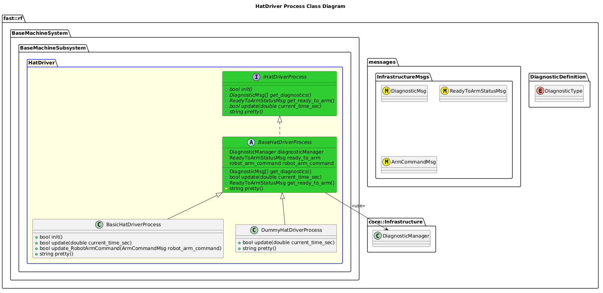

`@compare_tag Process-Document v0.1`
[BaseMachine Subsystem](../../../doc/Subsystem-BaseMachine.md)

- [Process: HatDriver](#process-hatdriver)
- [Overview](#overview)
  - [Purpose](#purpose)
  - [General Requirements](#general-requirements)
- [Inputs](#inputs)
- [Outputs](#outputs)
- [Diagnostics](#diagnostics)
- [How It Works](#how-it-works)
  - [Detailed Documentation](#detailed-documentation)
  - [Class Diagram](#class-diagram)
  - [HatDriver Process Implementati](#hatdriver-process-implementati)
- [Usage Instructions](#usage-instructions)
- [Validation](#validation)

# Process: HatDriver

# Overview

## Purpose

This process's objective is to ???.

## General Requirements

# Inputs

The following inputs are required in order for this system to properly function.

| Input | DataType | Description | Requirement |
| ----- | -------- | ----------- | ----------- |

# Outputs

The following outputs are provided by this system.

| Output | DataType | Description | Usage |
| ------ | -------- | ----------- | ----- |

# Diagnostics
Processes in this Subsystem are defined by:
- System: TODO
- Subsystem: TODO
- Process: TODO

The following Diagnostics are reported by this Process:
| Diagnostic Type | Description |
| --------------- | ----------- |

# How It Works

## Detailed Documentation

## Class Diagram

## HatDriver Process Implementati
| Status | Implementation                                                            | Details                             |
| ------ | ------------------------------------------------------------------------- | ----------------------------------- |
| NEW    | DummyHatDriverProcess                                                     | Used for generating fake data       |
| NEW    | [BasicHatDriverProcess](ProcessImplementations/Process-BasicHatDriver.md) | Trivial implentation, very limited. |
| NEW    | [ServoHatDriverProcess](ProcessImplementations/Process-ServoHatDriver.md) | Driver and Process for a Servo Hat  |

# Usage Instructions

# Validation
