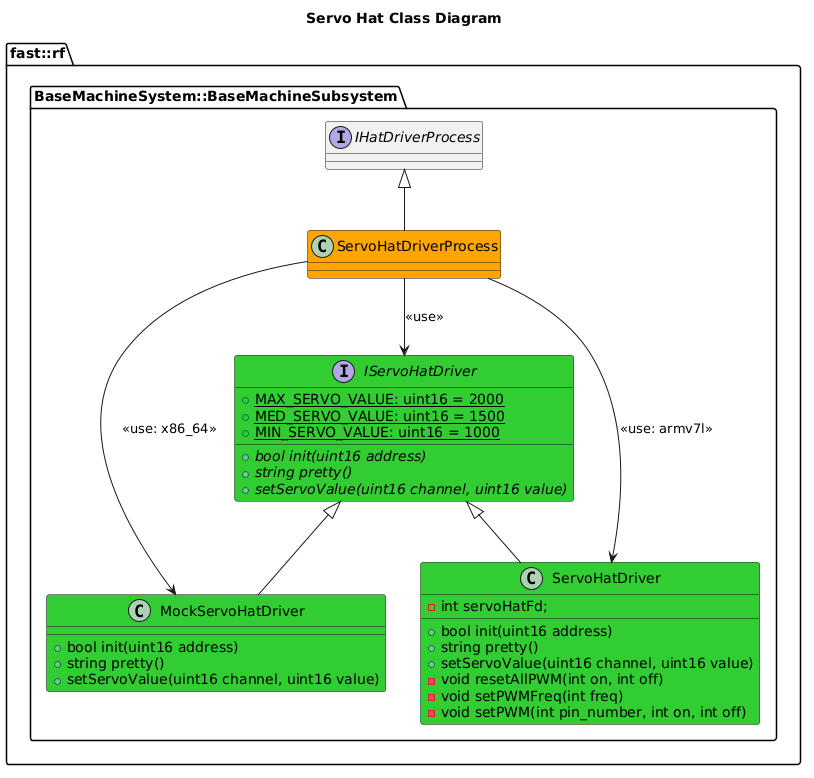

[HatDriver Process](../Process-HatDriver.md)

- [Process Implementation: Servo Hat Driver](#process-implementation-servo-hat-driver)
- [Document History](#document-history)
- [Overview](#overview)
  - [ToDo](#todo)
  - [Purpose](#purpose)
  - [General Requirements](#general-requirements)
  - [Limitations](#limitations)
- [Process Architecture](#process-architecture)
- [Inputs](#inputs)
- [Outputs](#outputs)
- [How It Works](#how-it-works)
  - [Detailed Documentation](#detailed-documentation)
  - [Class Diagram](#class-diagram)
- [Usage Instructions](#usage-instructions)
  - [Test Executable](#test-executable)
    - [Modes](#modes)
  - [Artifacts Provides](#artifacts-provides)
  - [Integration Steps](#integration-steps)
- [Validation](#validation)
- [Helpful Commands](#helpful-commands)
  - [I2C Query](#i2c-query)

# Process Implementation: Servo Hat Driver

# Document History

| Version Number | Date         | Author     | Change           |
| :------------: | ------------ | ---------- | ---------------- |
|       0        | 11-July-2027 | David Gitz | Drafted Document |
# Overview

## ToDo

| Item                      |
| ------------------------- |
| Add Driver to Process     |
| Add API Calls for Process |
| Unit Testing              |
| Clean up documentation    |

## Purpose

This specific Process Implementation provides a way to control a Servo Hat.

## General Requirements

## Limitations

The following are a listing of all limitations in this module:

# Process Architecture

# Inputs

The following inputs are required in order for this system to properly function.

| Input | DataType | Description | Requirement |
| ----- | -------- | ----------- | ----------- |

# Outputs

The following outputs are provided by this system.

| Output | DataType | Description | Usage |
| ------ | -------- | ----------- | ----- |

# How It Works

## Detailed Documentation


## Class Diagram


# Usage Instructions
## Test Executable
A Test Executable is provided.  This executable changes based on the following architectures:
| Architecture | Driver               | Comments                                                         |
| ------------ | -------------------- | ---------------------------------------------------------------- |
| `x86_64`     | `MockServoHatDriver` | A Mock Servo Hat Driver that emulates the real Servo Hat Driver. |
| `armv7l`     | `ServoHatDriver`     | A Real Servo Hat Driver                                          |

To use this, after building/installing, run the following:
```bash
./install/bin/exec_servohat_driver <arguments>
```

### Modes
Mode: `direct`
```bash
./install/bin/exec_servohat_driver -c <Channel> -v <Value> # Sets Channel <Channel> to Value <Value> for 3 seconds, then resets and exits.
```

Mode: `reset`
```bash
./install/bin/exec_servohat_driver -r # Resets all Channels
```

Mode: `ramp`
```bash
./install/bin/exec_servohat_driver -c <Channel> -m ramp # Ramps Channel <Channel> up and down to max/min values
```

## Artifacts Provides
The following artifacts are provided:
| Artifact                | Description                                                |
| ----------------------- | ---------------------------------------------------------- |
| `servoHatDriver`        | A Driver for a Servo Hat capable of running on armv7l      |
| `mockServoHatDriver`    | A Mock Driver for a Servo Hat capable of running on x86_64 |
| `servoHatDriverProcess` | The Process that manages the Driver.                       |


## Integration Steps

# Validation

# Helpful Commands
## I2C Query
`i2cdetect -y 1`