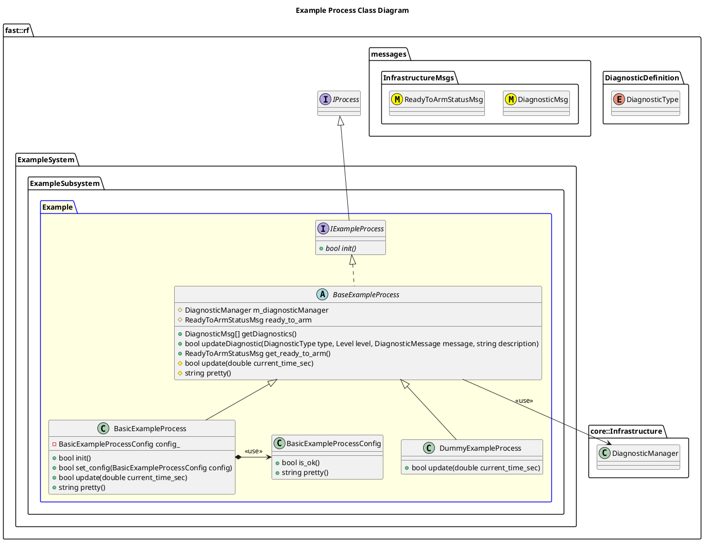

`@compare_tag Process-Document v0.1`
[Example Subsystem](../../../doc/Subsystem-Example.md)

- [Process: Example](#process-example)
- [Overview](#overview)
  - [Purpose](#purpose)
  - [General Requirements](#general-requirements)
- [Inputs](#inputs)
- [Outputs](#outputs)
- [Diagnostics](#diagnostics)
- [How It Works](#how-it-works)
  - [Detailed Documentation](#detailed-documentation)
  - [Class Diagram](#class-diagram)
  - [Example Process Implementation](#example-process-implementation)
- [Usage Instructions](#usage-instructions)
- [Validation](#validation)

# Process: Example

# Overview

## Purpose

This process's objective is to ???.

## General Requirements

# Inputs

The following inputs are required in order for this system to properly function.

| Input | DataType | Description | Requirement |
| ----- | -------- | ----------- | ----------- |

# Outputs

The following outputs are provided by this system.

| Output | DataType | Description | Usage |
| ------ | -------- | ----------- | ----- |

# Diagnostics
Processes in this Subsystem are defined by:
- System: `ExampleSystem::SYSTEM_ID`
- Subsystem: `ExampleSystem::ExampleSubsystem::SUBSYSTEM_ID`
- Process: `ExampleSystem::ExampleSubsystem::EXAMPLE`

The following Diagnostics are reported by this Process:
| Diagnostic Type | Description |
| --------------- | ----------- |

# How It Works

## Detailed Documentation

## Class Diagram

## Example Process Implementation

| Status | Implementation                                                               | Details                             |
| ------ | ---------------------------------------------------------------------------- | ----------------------------------- |
| NEW    | DummyExampleProcess                                                          | Used for generating fake data       |
| NEW    | [BasicExampleProcess](../doc/ProcessImplementations/Process-BasicExample.md) | Trivial implentation, very limited. |

# Usage Instructions

# Validation
