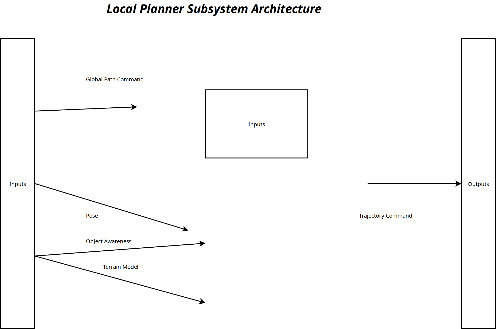
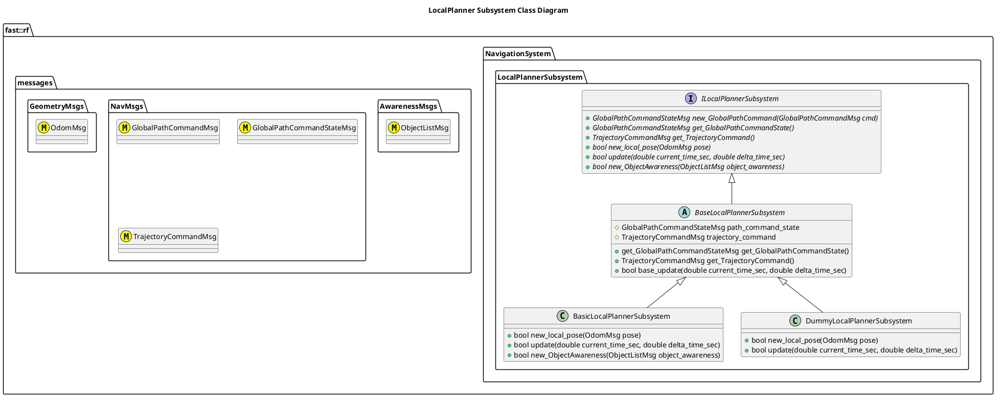

[Pose System](../../../doc/System-Navigation.md)

- [Subsystem: LocalPlanner](#subsystem-localplanner)
- [Document History](#document-history)
- [Overview](#overview)
  - [Purpose](#purpose)
  - [General Requirements](#general-requirements)
- [Subsystem Architecture](#subsystem-architecture)
  - [Class Diagram](#class-diagram)
- [Inputs](#inputs)
- [Outputs](#outputs)
- [How It Works](#how-it-works)
  - [General Information Flow](#general-information-flow)
  - [Detailed Documentation](#detailed-documentation)
  - [Software Content](#software-content)
- [Processes](#processes)
  - [Package Diagram](#package-diagram)
- [Usage Instructions](#usage-instructions)
- [Validation](#validation)

# Subsystem: LocalPlanner

# Document History

| Version Number | Date         | Author     | Change           |
| :------------: | ------------ | ---------- | ---------------- |
|       0        | 24-June-2026 | David Gitz | Drafted Document |

# Overview

## Purpose

The LocalPlanner Subsystem's role in the Robot Framework is to ???

## General Requirements

# Subsystem Architecture

## Class Diagram

# Inputs

The following inputs are required in order for this system to properly function.

| Input | DataType | Description | Requirement |
| ----- | -------- | ----------- | ----------- |

# Outputs

The following outputs are provided by this system.

| Output | DataType | Description | Usage |
| ------ | -------- | ----------- | ----- |

# How It Works

## General Information Flow

The Local Planner Subsystem typicall works in the following manner:

1. Receives a new Global Path Command
2. Processes the Global Path Command and replies if the Command was accepted or not.
3. Generates Trajectory Commands to follow the Global Path Command based on the robot's current pose
4. Modifies the Trajectory Commands as other objects in the local environment affect how the robot should move.

## Detailed Documentation

## Software Content

# Processes

| Status | Process |
| ------ | ------- |

## Package Diagram

# Usage Instructions

# Validation
