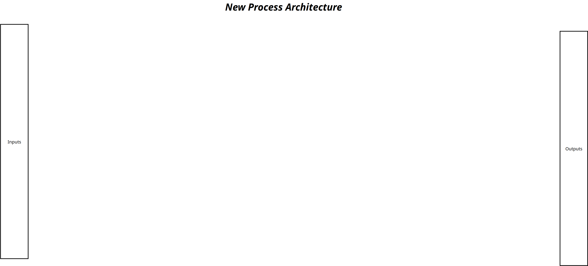
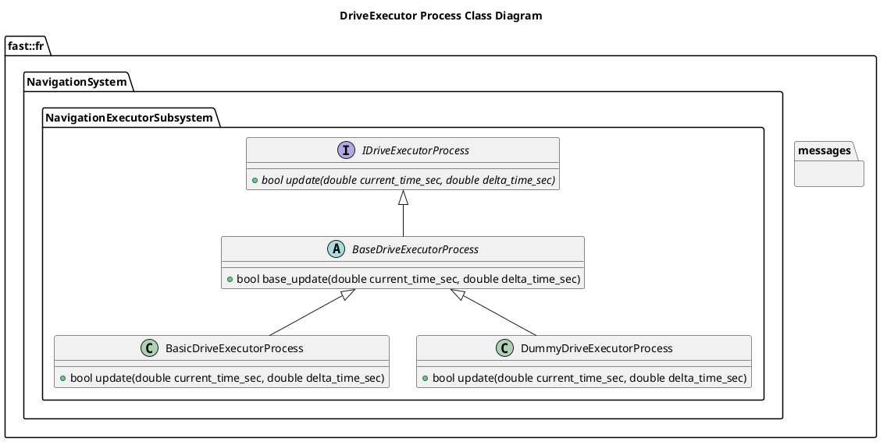

[Navigation Executor Subsystem](../../../doc/Subsystem-NavigationExecutor.md)

- [Process: Drive Executor](#process-drive-executor)
- [Document History](#document-history)
- [Overview](#overview)
  - [Purpose](#purpose)
  - [General Requirements](#general-requirements)
- [Process Architecture](#process-architecture)
- [Inputs](#inputs)
- [Outputs](#outputs)
- [How It Works](#how-it-works)
  - [Detailed Documentation](#detailed-documentation)
  - [Class Diagram](#class-diagram)
  - [Drive Executor Process Implementations](#drive-executor-process-implementations)
- [Usage Instructions](#usage-instructions)
- [Validation](#validation)

# Process: Drive Executor

# Document History

| Version Number | Date | Author | Change |
| :------------: | ---- | ------ | ------ |

# Overview

## Purpose

This process's objective is to take a Twist Command and convert to the specific machine platform drive commands.

## General Requirements

# Process Architecture

# Inputs

The following inputs are required in order for this system to properly function.

| Input | DataType | Description | Requirement |
| ----- | -------- | ----------- | ----------- |

# Outputs

The following outputs are provided by this system.

| Output | DataType | Description | Usage |
| ------ | -------- | ----------- | ----- |

# How It Works

## Detailed Documentation

## Class Diagram

## Drive Executor Process Implementations

| Status | Implementation                                                                     | Details                                         |
| ------ | ---------------------------------------------------------------------------------- | ----------------------------------------------- |
| NEW    | DummyDriveExecutorProcess                                                          | Used for generating fake data                   |
| NEW    | [BasicDriveExecutorProcess](ProcessImplementations/Process-BasicDriveExecutor.md)  | Trivial implentation, very limited.             |
| DRAFT  | [Tank Drive Executor Process](ProcessImplementations/Process-TankDriveExecutor.md) | Drive Executor applicable to Tank Drive robots. |

# Usage Instructions

# Validation
