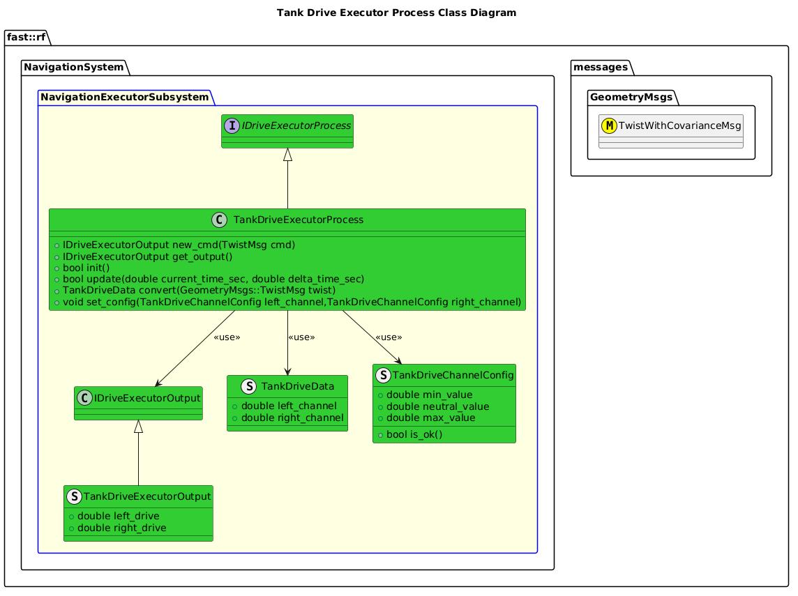

[Drive Executor Process](../Process-DriveExecutor.md)

- [Process Implementation: Tank Drive Executor](#process-implementation-tank-drive-executor)
- [Overview](#overview)
  - [Purpose](#purpose)
  - [General Requirements](#general-requirements)
  - [Limitations](#limitations)
- [Process Architecture](#process-architecture)
  - [Class Diagram](#class-diagram)
- [Inputs](#inputs)
- [Outputs](#outputs)
- [Diagnostics](#diagnostics)
- [How It Works](#how-it-works)
  - [Detailed Documentation](#detailed-documentation)
  - [Class Diagram](#class-diagram-1)
  - [Diagnostics](#diagnostics-1)
- [Usage Instructions](#usage-instructions)
  - [Artifacts Provides](#artifacts-provides)
  - [Integration Steps](#integration-steps)
    - [Build Instructions](#build-instructions)
    - [Code Instructions](#code-instructions)
- [Validation](#validation)

# Process Implementation: Tank Drive Executor

# Overview

## Purpose

This specific Process Implementation provides the ability to convert the generic Twist Command for any mobile robot to the specific kinematic requirements of a Tank Drive robot.

## General Requirements

## Limitations

The following are a listing of all limitations in this module:

# Process Architecture


## Class Diagram


# Inputs

The following inputs are required in order for this system to properly function.

| Input | DataType | Description | Requirement |
| ----- | -------- | ----------- | ----------- |

# Outputs

The following outputs are provided by this system.

| Output | DataType | Description | Usage |
| ------ | -------- | ----------- | ----- |

# Diagnostics
The root diagnostic for these diagnostics is given by:
- System: `NavigationSystem::SYSTEM_ID`
- Subsystem: `NavigationSystem::NavigationExecutorSubsystem::SUBSYSTEM_ID`
- Process: `NavigationSystem::NavigationExecutorSubsystem::PROCESS_DRIVE_EXECUTOR_ID`

Additional Diagnostic Types are implemented specifically for this Process Implementation:
| Diagnostic Type  |
| ---------------- |
| `SOFTWARE`       |
| `REMOTE_CONTROL` |
| `ACTUATORS`      |

# How It Works

## Detailed Documentation


## Class Diagram


## Diagnostics
The following Diagnostics are reported by this Process:
| Diagnostic Type  | Description                                    |
| ---------------- | ---------------------------------------------- |
| `SOFTWARE`       | General Software readiness                     |
| `REMOTE_CONTROL` | Un-trips when R/C commands are being provided. |


# Usage Instructions
## Artifacts Provides
The following artifacts are provided:
| Artifact                   | Description                                      |
| -------------------------- | ------------------------------------------------ |
| `TankDriveExecutorProcess` | General Library that provides this functionality |


## Integration Steps
### Build Instructions
Add the following to your CMakeLists.txt file:
```cmake
target_link_libraries(<binary> <blah> TankDriveExecutorProcess)
```

### Code Instructions
NOTE: Consult this module's [API](https://fastrobotics.github.io/robot_framework/classfast_1_1rf_1_1NavigationSystem_1_1NavigationExecutorSubsystem_1_1TankDriveExecutorProcess.html) when in doubt.

Add the following to your header:

```cpp
#include <TankDriveExecutorProcess/TankDriveExecutorProcess.hpp>
...
fast::rf::NavigationSystem::NavigationExecutorSubsystem::TankDriveExecutorProcess
            process;  //!< Execution Process
```

Add the following to your implementation:
```cpp
// Initialize:
process.init();
fast::rf::NavigationSystem::NavigationExecutorSubsystem::TankDriveChannelConfig left_channel_config(1000.0, 1500.0, 2000.0); // Or whatever your definition is
fast::rf::NavigationSystem::NavigationExecutorSubsystem::TankDriveChannelConfig right_channel_config(1000.0, 1500.0, 2000.0); // Or whatever your definition is
process.set_config(left_channel_config, right_channel_config);

// Update the process at a periodic rate
process.update(now,delta_now) // Some current timestamp, along with the time since it was previously updated.

// Provide it a command
process.new_command(twist)

// Get the converted output
fast::rf::NavigationSystem::NavigationExecutorSubsystem::IDriveExecutorOutput* general_output =  process.get_output();
fast::rf::NavigationSystem::NavigationExecutorSubsystem::TankDriveExecutorOutput* output =
  dynamic_cast<fast::rf::NavigationSystem::NavigationExecutorSubsystem::TankDriveExecutorOutput*>(general_output);
```

See the API for more detail, how to inspect diagnostics, etc.

# Validation
This content is validated using data created in [Tank Drive Calculations](data/TankDriveCalculations.ods)