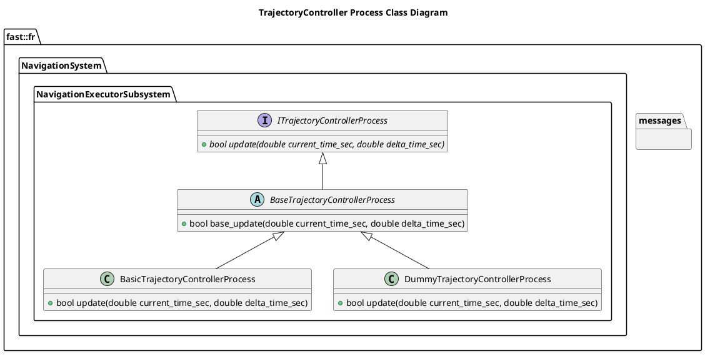

[Navigation Executor Subsystem](../../../doc/Subsystem-NavigationExecutor.md)

- [Process: Trajectory Controller](#process-trajectory-controller)
- [Document History](#document-history)
- [Overview](#overview)
  - [Purpose](#purpose)
  - [General Requirements](#general-requirements)
- [Process Architecture](#process-architecture)
- [Inputs](#inputs)
- [Outputs](#outputs)
- [How It Works](#how-it-works)
  - [Detailed Documentation](#detailed-documentation)
  - [Class Diagram](#class-diagram)
  - [Trajectory Controller Process Implementations](#trajectory-controller-process-implementations)
- [Usage Instructions](#usage-instructions)
- [Validation](#validation)

# Process: Trajectory Controller

# Document History

| Version Number | Date | Author | Change |
| :------------: | ---- | ------ | ------ |

# Overview

## Purpose

This process's objective is to take a specifc Twist Command and the current robot Pose, and form a control loop to output a corrected Twist Command.

## General Requirements

# Process Architecture

# Inputs

The following inputs are required in order for this system to properly function.

| Input | DataType | Description | Requirement |
| ----- | -------- | ----------- | ----------- |

# Outputs

The following outputs are provided by this system.

| Output | DataType | Description | Usage |
| ------ | -------- | ----------- | ----- |

# How It Works

## Detailed Documentation

## Class Diagram

## Trajectory Controller Process Implementations

| Status | Implementation                                                                                  | Details                             |
| ------ | ----------------------------------------------------------------------------------------------- | ----------------------------------- |
| NEW    | DummyTrajectoryControllerProcess                                                                | Used for generating fake data       |
| NEW    | [BasicTrajectoryControllerProcess](ProcessImplementations/Process-BasicTrajectoryController.md) | Trivial implentation, very limited. |

# Usage Instructions

# Validation
