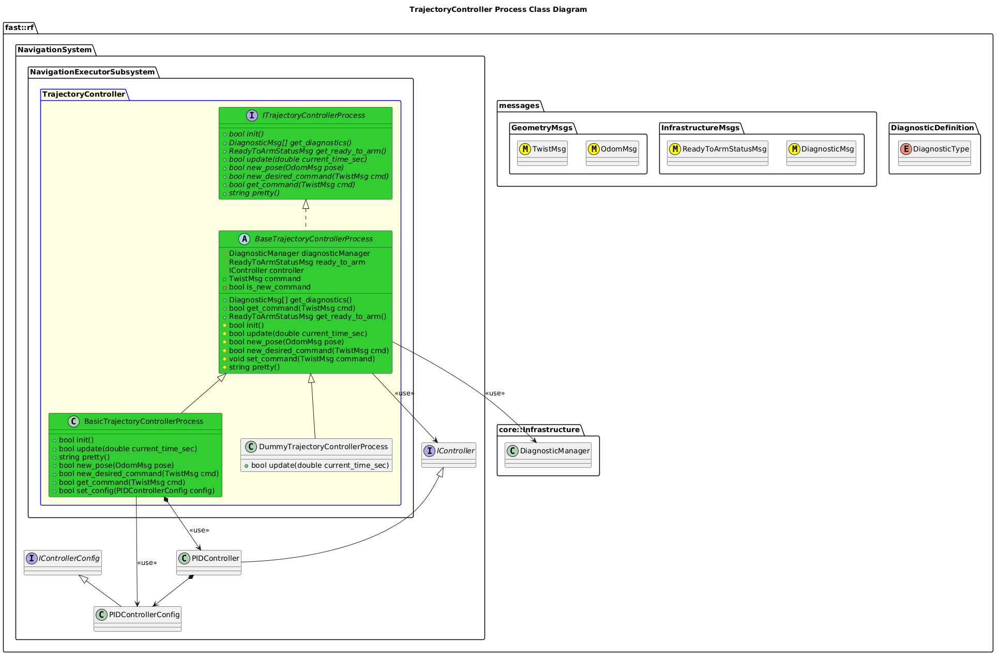

`@compare_tag Process-Document`
[Navigation Executor Subsystem](../../../doc/Subsystem-NavigationExecutor.md)

- [Process: Trajectory Controller](#process-trajectory-controller)
- [Overview](#overview)
  - [Purpose](#purpose)
  - [General Requirements](#general-requirements)
- [Inputs](#inputs)
- [Outputs](#outputs)
- [Diagnostics](#diagnostics)
- [How It Works](#how-it-works)
  - [Detailed Documentation](#detailed-documentation)
  - [Class Diagram](#class-diagram)
  - [Trajectory Controller Process Implementations](#trajectory-controller-process-implementations)
- [Usage Instructions](#usage-instructions)
- [Validation](#validation)

# Process: Trajectory Controller

# Overview

## Purpose

This process's objective is to take a specifc Twist Command and the current robot Pose, and form a control loop to output a corrected Twist Command.

## General Requirements

# Inputs

The following inputs are required in order for this system to properly function.

| Input              | DataType   | Description                                     | Requirement |
| ------------------ | ---------- | ----------------------------------------------- | ----------- |
| Pose               | `OdomMsg`  | Robot Pose                                      |             |
| Desired Trajectory | `TwistMsg` | The Desired Trajectory for the Robot to follow. |

# Outputs

The following outputs are provided by this system.

| Output             | DataType   | Description                                       | Usage |
| ------------------ | ---------- | ------------------------------------------------- | ----- |
| Command Trajectory | `TwistMsg` | The Commanded Trajectory for the Robot to follow. |       |

# Diagnostics
Processes in this Subsystem are defined by:
- System: `NavigationSystem::SYSTEM_ID`
- Subsystem: `NavigationSystem::NavigationExecutorSubsystem::SUBSYSTEM_ID`
- Process: `NavigationSystem::NavigationExecutorSubsystem::PROCESS_TRAJECTORY_CONTROLLER_ID`

The following Diagnostics are reported by this Process:
| Diagnostic Type | Description                                                |
| --------------- | ---------------------------------------------------------- |
| `SOFTWARE`      | General Diagnostics related to software processing issues. |
| `POSE`          | Triggered until Pose Data is received.                     |

# How It Works
Generally the Trajectory Controller works by consuming a Set Point Trajectory and Robot Pose, to then determine the Trajectory to Execute.

## Detailed Documentation

## Class Diagram

## Trajectory Controller Process Implementations

| Status | Implementation                                                                                  | Details                                                                     |
| ------ | ----------------------------------------------------------------------------------------------- | --------------------------------------------------------------------------- |
| NEW    | DummyTrajectoryControllerProcess                                                                | Used for generating fake data                                               |
| DRAFT  | [BasicTrajectoryControllerProcess](ProcessImplementations/Process-BasicTrajectoryController.md) | PID Controller on Twist-Angular Z component.  Everything else is pass-thru. |

# Usage Instructions
See specific Process Implementations for Usage Instructions.

# Validation
See specific Process Implementations for Validation information.
