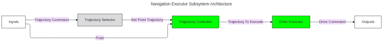
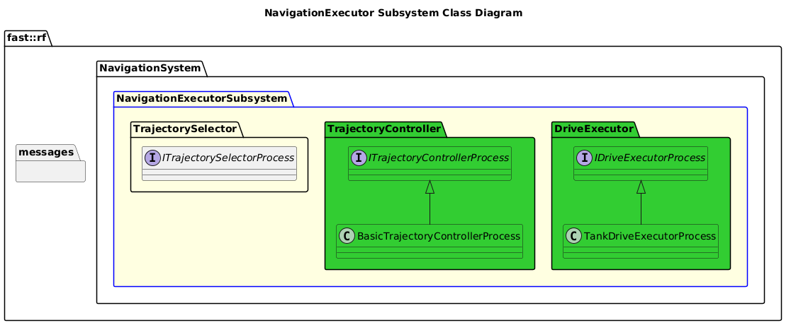

[Navigation System](../../../doc/System-Navigation.md)

- [Subsystem: NavigationExecutor](#subsystem-navigationexecutor)
- [Overview](#overview)
  - [Purpose](#purpose)
  - [General Requirements](#general-requirements)
- [Subsystem Architecture](#subsystem-architecture)
  - [Class Diagram](#class-diagram)
- [Processes](#processes)
  - [Package Diagram](#package-diagram)
- [Usage Instructions](#usage-instructions)
- [Validation](#validation)
  - [Process Interface Tests](#process-interface-tests)
  - [Minimal Process Functionality Tests](#minimal-process-functionality-tests)

# Subsystem: NavigationExecutor

# Overview

## Purpose

The NavigationExecutor Subsystem's role in the Robot Framework is to ???

## General Requirements

# Subsystem Architecture

## Class Diagram

# Processes

| Status | Process                                                                                        |
| ------ | ---------------------------------------------------------------------------------------------- |
| NEW    | [Trajectory Selector](../Processes/TrajectorySelector/doc/Process-TrajectorySelector.md)       |
| DRAFT  | [Trajectory Controller](../Processes/TrajectoryController/doc/Process-TrajectoryController.md) |
| DRAFT  | [Drive Executor](../Processes/DriveExecutor/doc/Process-DriveExecutor.md)                      |

## Package Diagram

# Usage Instructions

# Validation
This Subsystem is validated in the following ways:
## Process Interface Tests
- A test is constructed that created trivial concrete implements of all process interfaces.  Then the full subsystem is exercised.

## Minimal Process Functionality Tests
- A test is constructed that instantiates all basic level process functionality.  Then the full subsystem is exercised.
