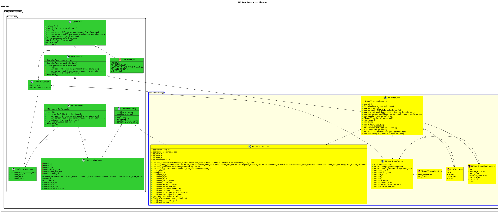
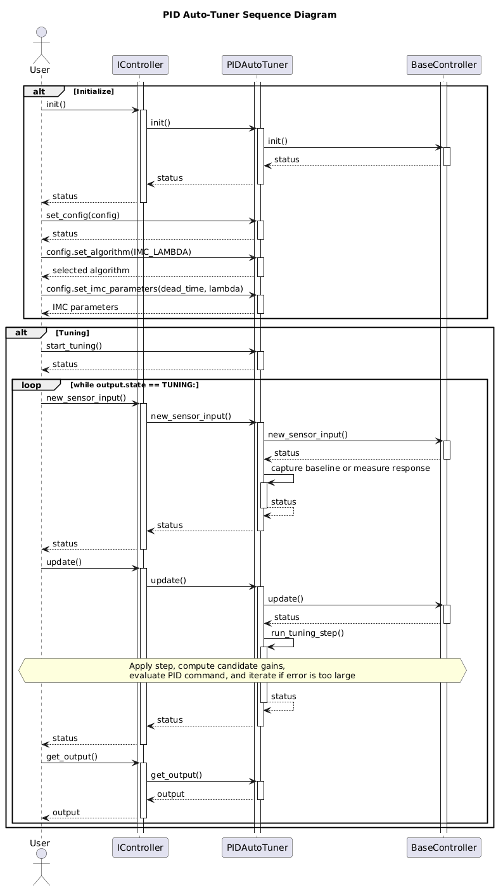

[Navigation System](System-Navigation.md)

- [PID Auto Tuner](#pid-auto-tuner)
  - [ToDo List](#todo-list)
  - [Overview](#overview)
  - [Tuning Algorithms](#tuning-algorithms)
- [Requirements](#requirements)
  - [Requirement: Dynamically compute PID Gains, Desired Output and Generated Set Point](#requirement-dynamically-compute-pid-gains-desired-output-and-generated-set-point)
  - [Requirement: Completely own the Tuning Process](#requirement-completely-own-the-tuning-process)
  - [Requirement: Report a Auto-Tuning State](#requirement-report-a-auto-tuning-state)
  - [Requirement: Provide Easy Mocking capabilities](#requirement-provide-easy-mocking-capabilities)
  - [Requirement: Provide easy interface for calibration parameter loading and saving](#requirement-provide-easy-interface-for-calibration-parameter-loading-and-saving)
  - [Requirement: Debuggable](#requirement-debuggable)
  - [Requirement: Support multiple Tuning Algorithms](#requirement-support-multiple-tuning-algorithms)
  - [Requirement: Tuning Algorithm State Machine](#requirement-tuning-algorithm-state-machine)
  - [Requirement: Tuner has defined stopping point](#requirement-tuner-has-defined-stopping-point)
- [Architecture](#architecture)
  - [Class Diagram](#class-diagram)
  - [State Machine](#state-machine)
  - [Sequence Diagrams](#sequence-diagrams)
  - [Integration Guide](#integration-guide)
    - [1. Include And Link The Module](#1-include-and-link-the-module)
    - [2. Configure And Start](#2-configure-and-start)
    - [3. Run The Control Loop](#3-run-the-control-loop)
    - [4. Read The Result](#4-read-the-result)
    - [Failure Diagnostics](#failure-diagnostics)

# PID Auto Tuner
## ToDo List
- Delete the current RelayAutoTuneController content.
- 
## Overview
The PID Auto-Tuner module is designed to tune a system such that the values calibrated can be directly used in a PID Controller.

## Tuning Algorithms

The following algorithms are candidates for the PID Auto-Tuner. An algorithm
must both calculate candidate gains and apply/evaluate those gains against the
system before reporting successful tuning.

| Algorithm                                         | Description                                                                                                                                                                                                                                                  | Status                                |
| ------------------------------------------------- | ------------------------------------------------------------------------------------------------------------------------------------------------------------------------------------------------------------------------------------------------------------ | ------------------------------------- |
| Bounded step response with closed-loop evaluation | Captures a baseline, applies a configured output step, measures the response, calculates candidate P/I/D gains, applies those gains, and evaluates tracking error. Candidate gains are adjusted and retried when the error exceeds the configured threshold. | **Implemented**                       |
| Relay feedback / relay auto-tune                  | Switches the output between two relay levels and derives gains from the resulting oscillation amplitude and period. The repository has a separate `RelayAutoTuneController`, but it is not currently an algorithm selectable by `PIDAutoTuner`.              | **Partially available**               |
| IMC / Lambda step-response tuning                 | Uses the measured process gain with configured dead time and desired closed-loop time constant, Lambda, to select conservative or aggressive gains. Candidate gains are then applied and evaluated in closed loop.                                           | **Implemented**                       |
| Ziegler-Nichols step-response tuning              | Estimates process gain, dead time, and time constant from a step response, then applies the Ziegler-Nichols tuning rules. It generally produces more aggressive gains than IMC/Lambda tuning.                                                                | **Not implemented**                   |
| Ziegler-Nichols ultimate-gain tuning              | Increases loop gain until sustained oscillation is observed, then derives gains from ultimate gain and oscillation period.                                                                                                                                   | **Not implemented in `PIDAutoTuner`** |
| Cohen-Coon tuning                                 | Uses a first-order-plus-dead-time model and is intended to compensate for process dead time, often at the cost of more aggressive behavior.                                                                                                                  | **Not implemented**                   |

The current implementation supports bounded step-response and IMC/Lambda
tuning, selected by `PIDAutoTuningAlgorithm`. The selector is part of the
public configuration API. Unsupported algorithms are rejected until their
implementations are added. IMC/Lambda additionally requires process dead time
and the desired closed-loop time constant:

```cpp
config.set_algorithm(PIDAutoTuningAlgorithm::IMC_LAMBDA);
config.set_imc_parameters(
  0.2, // process dead time in seconds
  2.0); // desired closed-loop time constant, Lambda, in seconds
```

# Requirements
Each Requirement will have:
- A status if it was Met/Did Not Meet (and justification why)
- The name and description
- Evidence showing that it was met
## Requirement: Dynamically compute PID Gains, Desired Output and Generated Set Point
*Met?* Partially met.

*Description*

The first implementation computes PID gains from a bounded step-response
measurement and exposes the generated set point and desired output through
`PIDAutoTunerOutput`. These values can be displayed or stored by the caller.

*Evidence*

`PIDAutoTunerOutput` contains `set_point`, `command_value`, `K_P`, `K_I`, and
`K_D`. `test_PIDAutoTuner.cpp` verifies that a valid response produces nonzero
gains.

## Requirement: Completely own the Tuning Process
*Met?* Partially met.

*Description*

The implementation owns baseline capture, generated target set point, output
step, response measurement, candidate PID evaluation, gain iteration, timeout
handling, and completion/failure transitions. The selected algorithm and its
configuration are supplied before tuning.

*Evidence*

After `start_tuning()`, the first sensor sample establishes the baseline and
the tuner generates the next set point. `update()` advances the algorithm and
drives the output command without another caller-selected set point.

## Requirement: Report a Auto-Tuning State
*Met?* Met for the first implementation.

*Description*

The Auto-Tuner reports `IDLE`, `TUNING`, `COMPLETE`, or `FAILED`. The tuning
algorithm also reports `CAPTURE_BASELINE`, `APPLY_STEP`, `MEASURE_RESPONSE`,
`EVALUATE_PID`, `COMPLETE`, or `FAILED`.

*Evidence*

`PIDAutoTunerOutput::state`, `algorithm`, and `algorithm_state` expose the
selected algorithm and both state machines. Tests cover tuning, completion,
IMC/Lambda selection, gain evaluation, iteration, and timeout failure.

## Requirement: Provide Easy Mocking capabilities
*Met?* Not implemented in this module yet.

*Description*

The Auto-Tuner should be capable of easily mocking behaviour.  Intent here is to validate any UI/integration components without negatively affecting a live system.  Enabling/Disabling this mode should be an easy switch, and no extra configuration required for the user beyond the required configuration for the production version of the Auto-Tuner.

*Evidence*

The existing relay controller mock remains separate. A common tuner interface
and an implementation-selection strategy are still required for this module.

## Requirement: Provide easy interface for calibration parameter loading and saving
*Met?* Partially met.

*Description*

The tuner accepts initial PID parameters through `set_parameters()` and
returns the calculated parameters through `get_tuned_config()`.

*Evidence*

`get_tuned_config()` returns a `PIDControllerConfig` after successful tuning.
Loading and saving a persistent file format is not implemented yet.

## Requirement: Debuggable
*Met?* Met for the first implementation.

*Description*

The Auto-Tuner should be capable of easy inspection of the state of the module.  

*Evidence*

`pretty()` reports configuration, main state, algorithm state, set point,
sensor value, and calculated gains.

## Requirement: Support multiple Tuning Algorithms
*Met?* Partially met.

*Description*

The Auto-Tuner should be capable of potentially multiple different tuning algorithms that could be enabled by the user.

*Evidence*

The implementation currently supports bounded step-response and IMC/Lambda
algorithms. The configuration selector and dispatch boundary allow additional
algorithms to be added later.

## Requirement: Tuning Algorithm State Machine
*Met?* Met for the first implementation.

*Description*

If a tuning algorithm has a series of steps it must go thru, it should follow a sub-state machine (while the main Auto-Tuner is in state `TUNING`).

*Evidence*

`PIDAutoTunerAlgorithmState` tracks baseline capture, step application,
response measurement, candidate PID evaluation, completion, and failure while
the main state is `TUNING`. Both supported algorithms use this same lifecycle;
IMC/Lambda changes the gain calculation after the response is measured. When
evaluation error exceeds the configured threshold, the tuner adjusts the
candidate gains and retries until the iteration limit is reached.

## Requirement: Tuner has defined stopping point
*Met?* As implemented currently, this requirement is not yet.

*Description*

The module should have various configuration options and automated checks that ensure that it is progressing towards a goal.  The module should quickly inform the user that if the tuning process isn't making progress, it should fail and indicate the reason why.

*Evidence*


# Architecture

## Class Diagram


## State Machine
The state machine source is [PIDAutoTunerStateMachine.puml](puml/PIDAutoTunerStateMachine.puml).
The main tuner remains in `TUNING` while its algorithm progresses through
baseline capture, step application, response measurement, and PID evaluation.
An unacceptable evaluation retries with adjusted gains until the configured
iteration limit is reached.

## Sequence Diagrams


The sequence includes the generated setpoint and output command flow. The
application must send `output.command_value` to the system and feed the
resulting sensor response back to the tuner. Candidate gains are applied and
evaluated before the tuner reports `COMPLETE`.

## Integration Guide

The application owns the `PIDAutoTuner` object and is responsible for calling
its lifecycle methods from the control loop. The tuner owns the tuning state,
generates the next set point, and produces the command that the application
should send to the system under test.

### 1. Include And Link The Module

Include the public header and link the `pid_auto_tuner_Controller` target in
the application target:

```cmake
target_link_libraries(my_application pid_auto_tuner_Controller)
```

```cpp
#include <ControllerTuner/PIDAutoTuner/PIDAutoTuner.hpp>
```

### 2. Configure And Start

Configure the initial PID values and the step-response parameters before
starting. The initial PID values are optional tuning context for the current
algorithm, but both parameter groups must be supplied and valid.

```cpp
using namespace fast::rf::NavigationSystem::Controller;
using namespace fast::rf::NavigationSystem::ControllerTuner;

PIDAutoTuner tuner;
PIDAutoTunerConfig config;

config.set_parameters(
  10.0,  // maximum output
  -10.0, // minimum output
  0.0,   // initial K_P
  0.0,   // initial K_I
  0.0,   // initial K_D
  1.0);  // sensor scale factor

config.set_tuning_parameters(
  2.0,  // output step applied to the system
  1.0,  // generated setpoint step
  1.0,  // settle time in seconds
  3.0,  // response timeout in seconds
  0.5,  // minimum measured response
  0.05, // acceptable maximum tracking error
  1.0,  // evaluation duration in seconds
  3);   // maximum candidate-gain iterations

if (!tuner.set_config(config) || !tuner.init() || !tuner.start_tuning()) {
  // Do not start the tuning loop when configuration or initialization fails.
}
```

### 3. Run The Control Loop

Provide sensor samples with timestamps and call `update()` using the same
monotonic time base. The first sensor sample captures the baseline. The tuner
then generates a setpoint and, on `update()`, publishes the output command.

```cpp
while (tuner.get_state() == AutoTunerState::TUNING) {
  double now_sec = get_monotonic_time_seconds();
  double sensor_value = read_sensor();

  if (!tuner.new_sensor_input(sensor_value, now_sec) || !tuner.update(now_sec)) {
    break;
  }

  PIDAutoTunerOutput* output = tuner.get_output();
  send_command(output->command_value);
  display_set_point(output->set_point);
  display_state(output->state, output->algorithm_state);
  delete output;
}
```

`get_output()` returns a newly allocated snapshot. The caller owns it and must
delete it after consuming the values. The command should be sent to the
system under test on every output update; the tuner does not publish directly
to hardware.

### 4. Read The Result

When the state becomes `COMPLETE`, the output contains the calculated gains
and `get_tuned_config()` returns a `PIDControllerConfig` suitable for use by
the PID controller.

```cpp
if (tuner.tuning_succeeded()) {
  PIDControllerConfig tuned_config = tuner.get_tuned_config();
  save_pid_configuration(tuned_config.get_K_P(), tuned_config.get_K_I(),
               tuned_config.get_K_D());
} else if (tuner.get_state() == AutoTunerState::FAILED) {
  report_tuning_failure();
}
```

The `TUNING` output may have zero `K_P`, `K_I`, and `K_D` values. They are
populated after the step response produces a candidate. The candidate gains
are then applied to the live system during the `EVALUATE_PID` algorithm state.
The tuner records the maximum absolute tracking error during the evaluation
window. It reaches `COMPLETE` only when that value is less than or equal to
`acceptable_error_threshold`. If the error is larger, the tuner adjusts the
candidate gains and retries while the main state remains `TUNING`; after
`max_tuning_iterations` unsuccessful evaluations it reaches `FAILED`.

### Failure Diagnostics

When tuning fails, `PIDAutoTunerOutput` contains a structured explanation:

| Field                   | Description                                                            |
| ----------------------- | ---------------------------------------------------------------------- |
| `failure_reason`        | Machine-readable `PIDAutoTunerFailureReason` enum value.               |
| `failure_reason_string` | Printable name of the enum value.                                      |
| `failure_attribute`     | The measured value or configuration attribute that caused the failure. |
| `failure_remediation`   | Suggested corrective action for the application or operator.           |

The current failure reasons are `INVALID_CONFIGURATION`, `RESPONSE_TIMEOUT`,
`INSUFFICIENT_RESPONSE`, `TRACKING_ERROR_EXCEEDED`,
`TUNING_ITERATION_LIMIT`, and `UNSUPPORTED_ALGORITHM`. A successful or reset
controller reports `NONE` and clears the related diagnostic strings.
