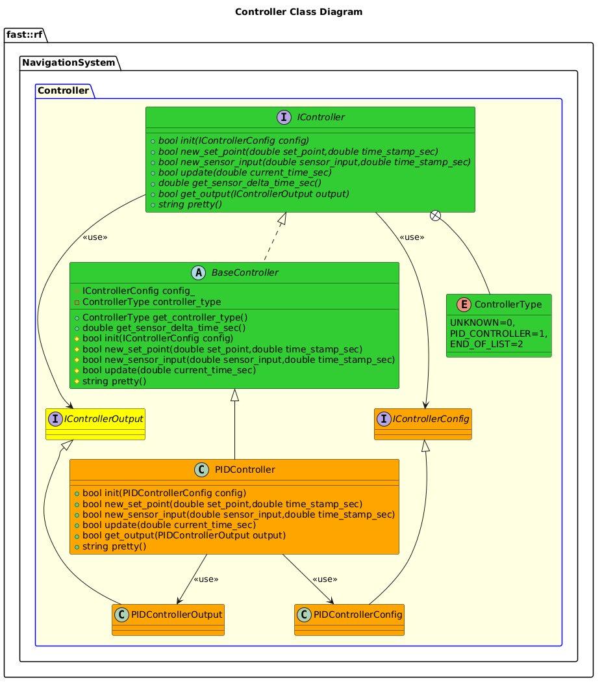
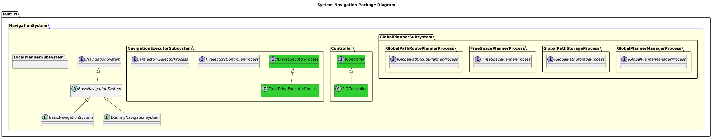

[README](../../../README.md)

[Architecture](../../../doc/Architecture/Architecture.md)

- [System: Navigation](#system-navigation)
- [Overview](#overview)
  - [Purpose](#purpose)
  - [General Requirements](#general-requirements)
- [System Architecture](#system-architecture)
- [Inputs](#inputs)
- [Outputs](#outputs)
- [How It Works](#how-it-works)
  - [Detailed Documentation](#detailed-documentation)
  - [Other Software Content](#other-software-content)
    - [Controller Software](#controller-software)
      - [Class Diagram](#class-diagram)
      - [PID Controller](#pid-controller)
- [Subsystems](#subsystems)
  - [Package Diagram](#package-diagram)
- [Usage Instructions](#usage-instructions)
- [Validation](#validation)

# System: Navigation

# Overview

## Purpose

The Navigation System's role in the Robot Framework is to ???.

## General Requirements

# System Architecture

# Inputs

The following inputs are required in order for this system to properly function.

| Input | DataType | Description | Requirement |
| ----- | -------- | ----------- | ----------- |

# Outputs

The following outputs are provided by this system.

| Output | DataType | Description | Usage |
| ------ | -------- | ----------- | ----- |

# How It Works

## Detailed Documentation

## Other Software Content
This package also provides the follow:
### Controller Software
The Controll Software is used to take in a desired set point and a sensor value and compute a command value based on the control system being used.

#### Class Diagram

#### PID Controller
PID Controllers can be used to tune specific types of Systems.

# Subsystems

The following Subsystems are provided in this System:

| State | Subsystem                                                                                   | Purpose                                                                                                              |
| ----- | ------------------------------------------------------------------------------------------- | -------------------------------------------------------------------------------------------------------------------- |
| NEW   | [Global Planner](../Subsystems/GlobalPlanner/doc/Subsystem-GlobalPlanner.md)                | Acts as a "Server" that can plan a path in the global frame.                                                         |
| NEW   | [Local Planner](../Subsystems/LocalPlanner/doc/Subsystem-LocalPlanner.md)                   | Given a path, will generate Drive Commands continuously.                                                             |
| DRAFT | [Navigation Executor](../Subsystems/NavigationExecutor/doc/Subsystem-NavigationExecutor.md) | Given Drive Commands, will generae Base Machine commands suitable for some Base Machine component to move the robot. |

## Package Diagram

# Usage Instructions

# Validation
