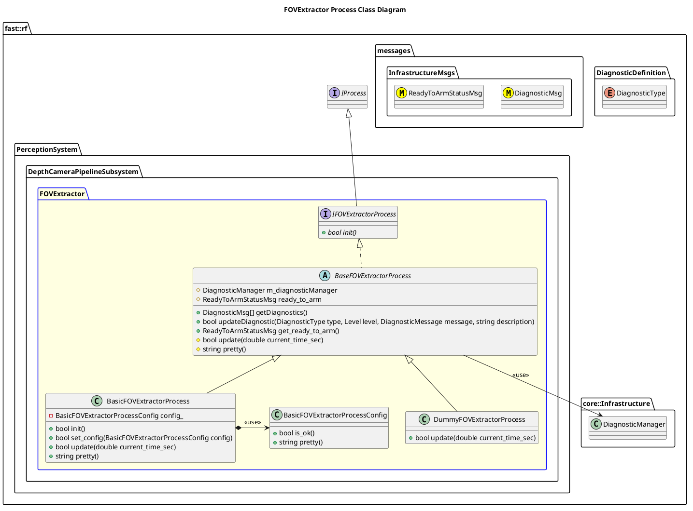

`@compare_tag Process-Document v0.1`
[DepthCameraPipeline Subsystem](../../../doc/Subsystem-DepthCameraPipeline.md)

- [Process: FOVExtractor](#process-fovextractor)
- [Overview](#overview)
  - [Purpose](#purpose)
  - [General Requirements](#general-requirements)
- [Inputs](#inputs)
- [Outputs](#outputs)
- [Diagnostics](#diagnostics)
- [How It Works](#how-it-works)
  - [Detailed Documentation](#detailed-documentation)
  - [Class Diagram](#class-diagram)
  - [FOVExtractor Process Implementation](#fovextractor-process-implementation)
- [Usage Instructions](#usage-instructions)
- [Validation](#validation)

# Process: FOVExtractor

# Overview

## Purpose

This process's objective is to take in a large dapth camera point cloud and with a selectable Field of View (FOV), create a smaller depth camera point cloud.  This is useful in usecases like examining objects more closely in the vehicles travel path.

## General Requirements

# Inputs

The following inputs are required in order for this system to properly function.

| Input | DataType | Description | Requirement |
| ----- | -------- | ----------- | ----------- |

# Outputs

The following outputs are provided by this system.

| Output | DataType | Description | Usage |
| ------ | -------- | ----------- | ----- |
|        |

# Diagnostics
Processes in this Subsystem are defined by:
- System: `PerceptionSystem::SYSTEM_ID`
- Subsystem: `PerceptionSystem::DepthCameraPipelineSubsystem::SUBSYSTEM_ID`
- Process: `PerceptionSystem::DepthCameraPipelineSubsystem::PROCESS_FOVEXTRACTOR_ID`

The following Diagnostics are reported by this Process:
| Diagnostic Type | Description |
| --------------- | ----------- |

# How It Works

## Detailed Documentation

## Class Diagram

## FOVExtractor Process Implementation

| Status | Implementation                                                                  | Details                             |
| ------ | ------------------------------------------------------------------------------- | ----------------------------------- |
| NEW    | DummyFOVExtractorProcess                                                        | Used for generating fake data       |
| NEW    | [BasicFOVExtractorProcess](ProcessImplementations/Process-BasicFOVExtractor.md) | Trivial implentation, very limited. |

# Usage Instructions

# Validation
