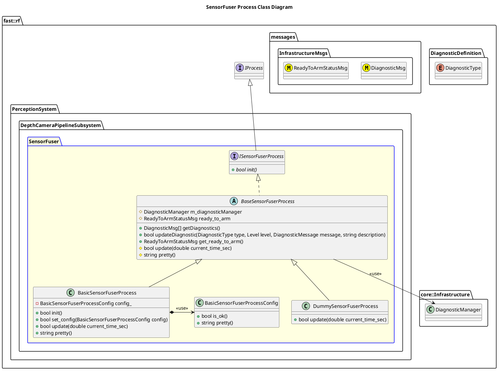

`@compare_tag Process-Document v0.1`
[DepthCameraPipeline Subsystem](../../../doc/Subsystem-DepthCameraPipeline.md)

- [Process: SensorFuser](#process-sensorfuser)
- [Overview](#overview)
  - [Purpose](#purpose)
  - [General Requirements](#general-requirements)
- [Inputs](#inputs)
- [Outputs](#outputs)
- [Diagnostics](#diagnostics)
- [How It Works](#how-it-works)
  - [Questions](#questions)
  - [Detailed Documentation](#detailed-documentation)
  - [Class Diagram](#class-diagram)
  - [SensorFuser Process Implementation](#sensorfuser-process-implementation)
- [Usage Instructions](#usage-instructions)
- [Validation](#validation)

# Process: SensorFuser

# Overview

## Purpose

This process's objective is to ???.

## General Requirements

# Inputs

The following inputs are required in order for this system to properly function.

| Input | DataType | Description | Requirement |
| ----- | -------- | ----------- | ----------- |

# Outputs

The following outputs are provided by this system.

| Output | DataType | Description | Usage |
| ------ | -------- | ----------- | ----- |

# Diagnostics
Processes in this Subsystem are defined by:
- System: `PerceptionSystem::SYSTEM_ID`
- Subsystem: `PerceptionSystem::DepthCameraPipelineSubsystem::SUBSYSTEM_ID`
- Process: `PerceptionSystem::DepthCameraPipelineSubsystem::PROCESS_SENSORFUSER_ID`

The following Diagnostics are reported by this Process:
| Diagnostic Type | Description |
| --------------- | ----------- |

# How It Works
This process workes in the following manner:
1. Multiple Depth Point Clouds are received at various times
2. An aggregated point cloud is computed that replaces each received point cloud by name via a `Combiner` class
3. As these combined point clouds are potentially overlapping, a class `OverlapRemover` is used to combine the overlapping regions into a more accurate but less dense section of the point cloud.
4. A `NoiseReducer` is ran on this fused cloud to remove extraneous measurements

## Questions
- How to timestamp data in the fused cloud?
- 
## Detailed Documentation

## Class Diagram

## SensorFuser Process Implementation

| Status | Implementation                                                                | Details                             |
| ------ | ----------------------------------------------------------------------------- | ----------------------------------- |
| NEW    | DummySensorFuserProcess                                                       | Used for generating fake data       |
| NEW    | [BasicSensorFuserProcess](ProcessImplementations/Process-BasicSensorFuser.md) | Trivial implentation, very limited. |

# Usage Instructions

# Validation
