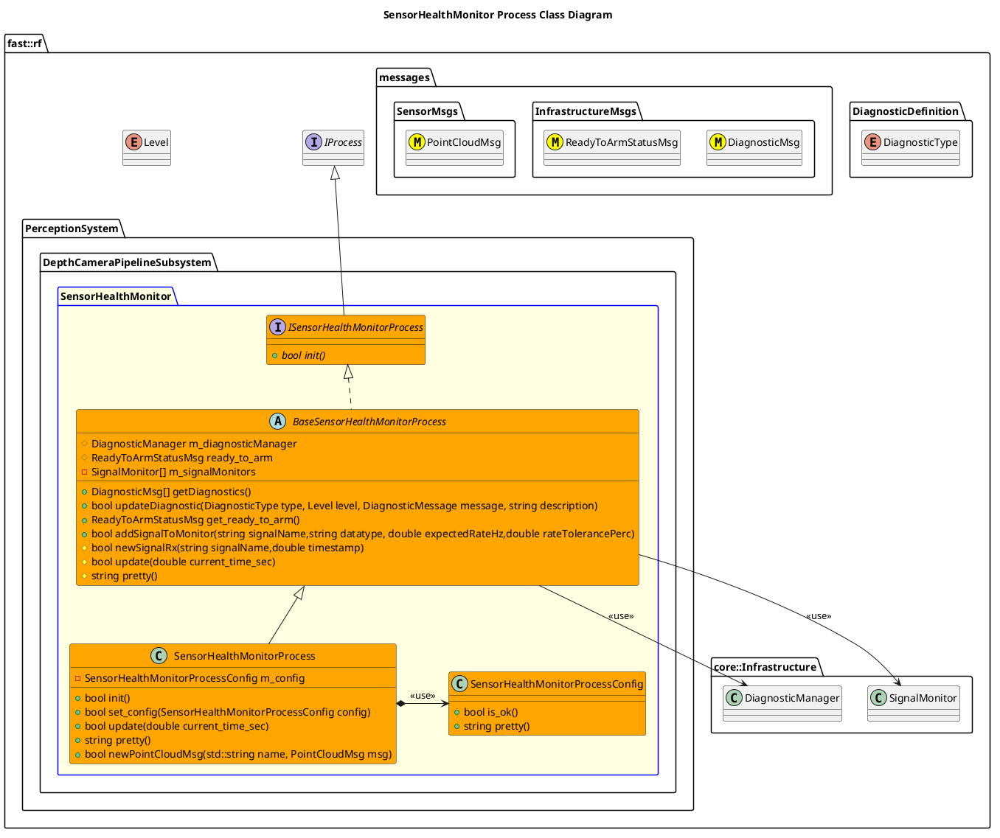

`@compare_tag Process-Document v0.1`
[DepthCameraPipeline Subsystem](../../../doc/Subsystem-DepthCameraPipeline.md)

- [Process: SensorHealthMonitor](#process-sensorhealthmonitor)
- [Overview](#overview)
  - [Purpose](#purpose)
  - [General Requirements](#general-requirements)
- [Inputs](#inputs)
- [Outputs](#outputs)
- [Diagnostics](#diagnostics)
- [How It Works](#how-it-works)
  - [ToDo](#todo)
  - [Detailed Documentation](#detailed-documentation)
  - [Class Diagram](#class-diagram)
- [Usage Instructions](#usage-instructions)
- [Validation](#validation)

# Process: SensorHealthMonitor

# Overview

## Purpose

This process's objective is to ???.

## General Requirements
| Requirement                    | Description                                                                                     |
| ------------------------------ | ----------------------------------------------------------------------------------------------- |
| 1 Active Sensor Health Monitor | The Sensor Health Monitor is responsible for monitoring all Depth Camera Pipeline Sensor Inputs |

# Inputs

The following inputs are required in order for this system to properly function.

| Input                        | DataType                | Description | Requirement |
| ---------------------------- | ----------------------- | ----------- | ----------- |
| Depth Camera Point Cloud 1-N | `SensorMsgs/PointCloud` |             |             |

# Outputs

The following outputs are provided by this system.

| Output      | DataType | Description | Usage |
| ----------- | -------- | ----------- | ----- |
| Diagnostics |          |             |       |

# Diagnostics
Processes in this Subsystem are defined by:
- System: `PerceptionSystem::SYSTEM_ID`
- Subsystem: `PerceptionSystem::DepthCameraPipelineSubsystem::SUBSYSTEM_ID`
- Process: `PerceptionSystem::DepthCameraPipelineSubsystem::PROCESS_SENSORHEALTHMONITOR_ID`

The following Diagnostics are reported by this Process:
| Diagnostic Type | Description |
| --------------- | ----------- |

# How It Works
The Sensor Health Monitor sets up a list of signal health monitors that actively monitor the input signals and check for various health indicators (such as new data, missing data, etc).

Additionally the Sensor Health Monitor can look holistically at all the sensor data coming in, and trigger diagnostics that are more general/wholistic.

## ToDo
- SignalHealthMonitor should be an abstract interface, and the data coming in should be able to be analyzed closely with whatever "plugins" are required for specific datatypes.
## Detailed Documentation


## Class Diagram



# Usage Instructions
```cmake
```

```cpp
```
# Validation
