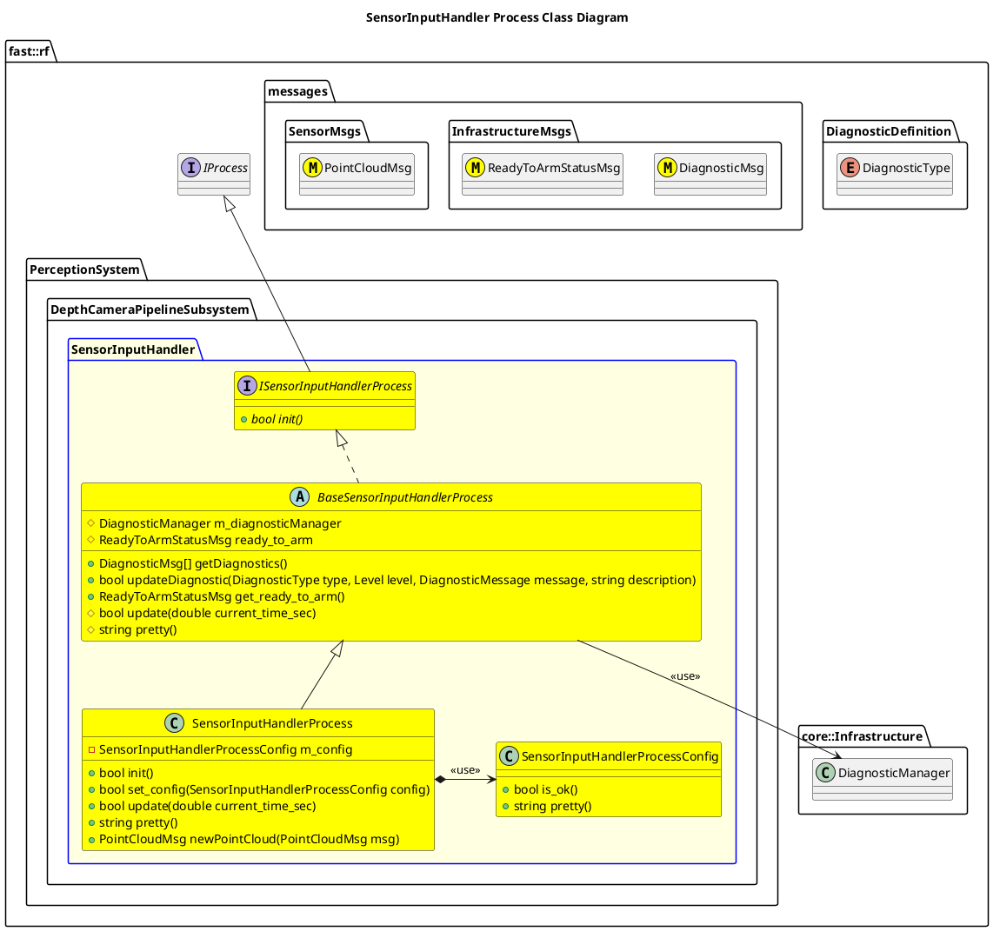

`@compare_tag Process-Document v0.1`

[DepthCameraPipeline Subsystem](../../../doc/Subsystem-DepthCameraPipeline.md)

- [Process: SensorInputHandler](#process-sensorinputhandler)
- [Overview](#overview)
  - [Purpose](#purpose)
  - [General Requirements](#general-requirements)
- [Inputs](#inputs)
- [Outputs](#outputs)
- [Diagnostics](#diagnostics)
- [How It Works](#how-it-works)
  - [Detailed Documentation](#detailed-documentation)
  - [Class Diagram](#class-diagram)
- [Usage Instructions](#usage-instructions)
- [Validation](#validation)

# Process: SensorInputHandler

# Overview

## Purpose

This process's objective is to ???.

## General Requirements
| Requirement                  | Description                                                                                                                                                                                                               |
| ---------------------------- | ------------------------------------------------------------------------------------------------------------------------------------------------------------------------------------------------------------------------- |
| 1 Active Instance per Sensor | The Sensor Input Handler is responsible for handling 1 single Sensor instance for the Depth Camera Pipeline.  As such, when there are multiple sensors, there should be multiple of these processes running concurrently. |

# Inputs

The following inputs are required in order for this system to properly function.

| Input                    | DataType                | Description | Requirement |
| ------------------------ | ----------------------- | ----------- | ----------- |
| Depth Camera Point Cloud | `SensorMsgs/PointCloud` |             |             |

# Outputs

The following outputs are provided by this system.

| Output                   | DataType                | Description                                                                                          | Usage |
| ------------------------ | ----------------------- | ---------------------------------------------------------------------------------------------------- | ----- |
| Depth Camera Point Cloud | `SensorMsgs/PointCloud` | A Point Cloud that is converted properly for the rest of the consumers of the Depth Camera Pipeline. |       |

# Diagnostics
Processes in this Subsystem are defined by:
- System: `PerceptionSystem::SYSTEM_ID`
- Subsystem: `PerceptionSystem::DepthCameraPipelineSubsystem::SUBSYSTEM_ID`
- Process: `PerceptionSystem::DepthCameraPipelineSubsystem::PROCESS_SENSORINPUTHANDLER_ID`

The following Diagnostics are reported by this Process:
| Diagnostic Type            | Description                                                              |
| -------------------------- | ------------------------------------------------------------------------ |
| `DiagnosticType::SOFTWARE` | General purpose Software Diagnostic                                      |
| `DiagnosticType::SENSORS`  | Checks if an unorganized point cloud is received, and triggers if it is. |

# How It Works
This Sensor Input Handler performs the following:
- Converts (if not already) input Point Clouds to Organized Point Clouds (useful for spatial analysis)

Note: Currently the Process is a pass-thru for organized point clouds, and will trip a diagnostic if an unorganized point cloud is received.
## Detailed Documentation


## Class Diagram



# Usage Instructions
```cmake
target_link_libraries(<binary or library> DepthCameraPipelineSubsystem::sensorInputHandlerProcess)
```

```cpp
#include <SensorInputHandlerProcess.hpp> // Include the Header
SensorInputHandlerProcess process;  // Initialize the process
auto convertedPointCloud = process.newPointCloud(<PointCloudMsg>); // Give it a Point Cloud and get the result
process.update(<timestamp>); // Update the Process regularly.
```
# Validation
