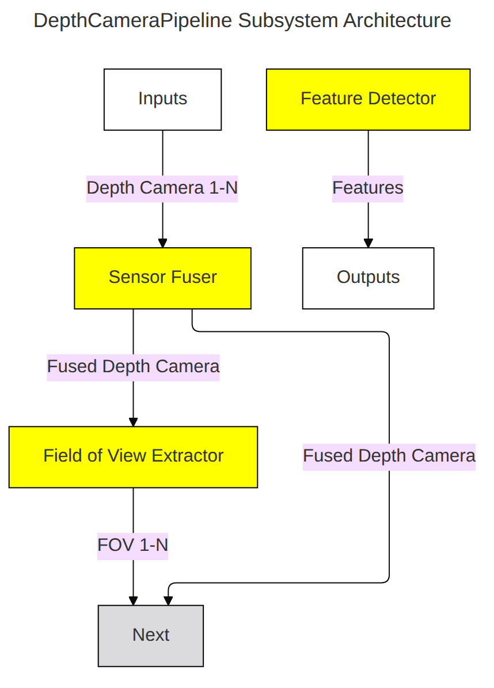
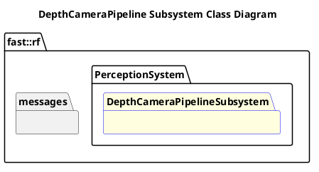

`@compare_tag Subsystem-Document v0.1`
[Perception System](../../../doc/System-Perception.md)

- [Subsystem: DepthCameraPipeline](#subsystem-depthcamerapipeline)
- [Overview](#overview)
  - [Purpose](#purpose)
  - [General Requirements](#general-requirements)
- [Subsystem Architecture](#subsystem-architecture)
  - [Class Diagram](#class-diagram)
- [Inputs](#inputs)
- [Outputs](#outputs)
- [How It Works](#how-it-works)
  - [Questions](#questions)
  - [Detailed Documentation](#detailed-documentation)
  - [Software Content](#software-content)
- [Processes](#processes)
  - [Package Diagram](#package-diagram)
- [Usage Instructions](#usage-instructions)
- [Validation](#validation)

# Subsystem: DepthCameraPipeline

# Overview

## Purpose

The DepthCameraPipeline Subsystem's role in the Robot Framework is to provide a common Depth Camera processing functionality that can be leveraged in other perception subsystems.

## General Requirements
| Requirement                                                                                                                                | Description                                     |
| ------------------------------------------------------------------------------------------------------------------------------------------ | ----------------------------------------------- |
| Follows Interface requirements of Perception System                                                                                        | Includes contracts, data integrity, rates, etc. |
| Minimal Latency/Memory Requirement- Intent for this subsystem is to operate in shared memory as processing/transporting data is expensive. |

# Subsystem Architecture

## Class Diagram

# Inputs

The following inputs are required in order for this system to properly function.

| Input                        | DataType                  | Description | Requirement |
| ---------------------------- | ------------------------- | ----------- | ----------- |
| Depth Camera Point Cloud 1-N | `sensor_msgs/PointCloud2` |             |             |

# Outputs

The following outputs are provided by this system.

| Output                           | DataType                  | Description | Usage |
| -------------------------------- | ------------------------- | ----------- | ----- |
| Fused Depth Camera Point Cloud   | `sensor_msgs/PointCloud2` |             |       |
| FOV Depth Camera Point Cloud 1-N | `sensor_msgs/PointCloud2` |             |       |
| Point Cloud Object Features      | TBD                       |             |       |

# How It Works
## Questions
- What is the linkage between the Field of View Extractor and the Feature Detector?
## Detailed Documentation

## Software Content

# Processes

| Status | Process                                                                         |
| ------ | ------------------------------------------------------------------------------- |
| NEW    | [Sensor Fuser](../Processes/SensorFuser/doc/Process-SensorFuser.md)             |
| NEW    | [FOV Extractor](../Processes/FOVExtractor/doc/Process-FOVExtractor.md)          |
| NEW    | [Feature Detector](../Processes/FeatureDetector/doc/Process-FeatureDetector.md) |

## Package Diagram

# Usage Instructions

# Validation
