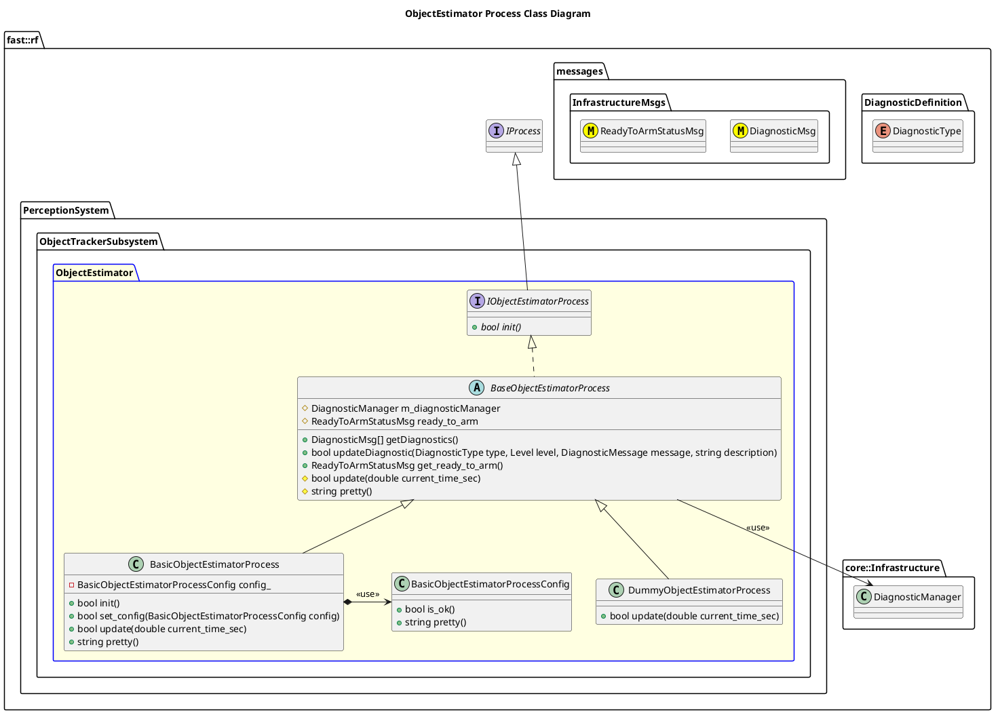

`@compare_tag Process-Document v0.1`
[ObjectTracker Subsystem](../../../doc/Subsystem-ObjectTracker.md)

- [Process: ObjectEstimator](#process-objectestimator)
- [Overview](#overview)
  - [Purpose](#purpose)
  - [General Requirements](#general-requirements)
- [Inputs](#inputs)
- [Outputs](#outputs)
- [Diagnostics](#diagnostics)
- [How It Works](#how-it-works)
  - [Detailed Documentation](#detailed-documentation)
  - [Class Diagram](#class-diagram)
  - [ObjectEstimator Process Implementation](#objectestimator-process-implementation)
- [Usage Instructions](#usage-instructions)
- [Validation](#validation)

# Process: ObjectEstimator

# Overview

## Purpose

This process's objective is to ???.

## General Requirements

# Inputs

The following inputs are required in order for this system to properly function.

| Input | DataType | Description | Requirement |
| ----- | -------- | ----------- | ----------- |

# Outputs

The following outputs are provided by this system.

| Output | DataType | Description | Usage |
| ------ | -------- | ----------- | ----- |

# Diagnostics
Processes in this Subsystem are defined by:
- System: `PerceptionSystem::SYSTEM_ID`
- Subsystem: `PerceptionSystem::ObjectTrackerSubsystem::SUBSYSTEM_ID`
- Process: `PerceptionSystem::ObjectTrackerSubsystem::PROCESS_OBJECTESTIMATOR_ID`

The following Diagnostics are reported by this Process:
| Diagnostic Type | Description |
| --------------- | ----------- |

# How It Works

## Detailed Documentation

## Class Diagram

## ObjectEstimator Process Implementation

| Status | Implementation                                                                        | Details                             |
| ------ | ------------------------------------------------------------------------------------- | ----------------------------------- |
| NEW    | DummyObjectEstimatorProcess                                                           | Used for generating fake data       |
| NEW    | [BasicObjectEstimatorProcess](ProcessImplementations/Process-BasicObjectEstimator.md) | Trivial implentation, very limited. |

# Usage Instructions

# Validation
