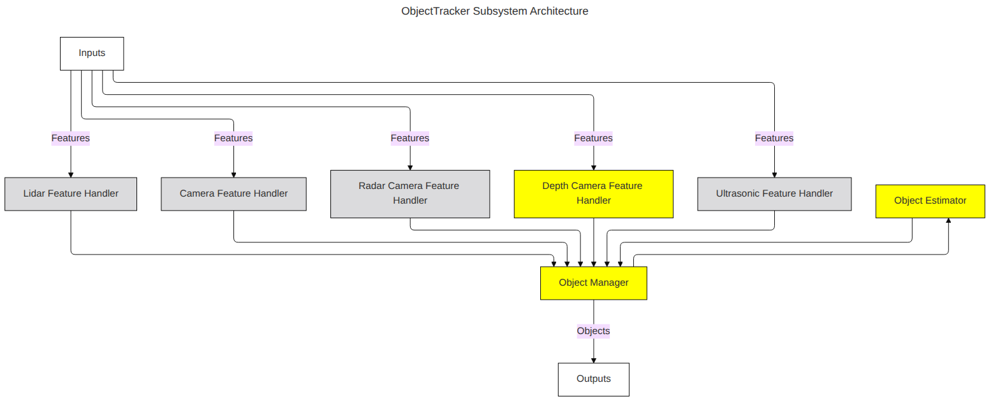
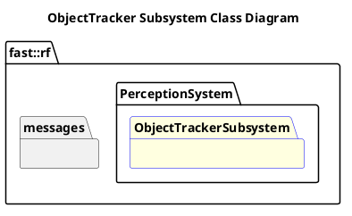

`@compare_tag Subsystem-Document v0.1`
[Perception System](../../../doc/System-Perception.md)

- [Subsystem: ObjectTracker](#subsystem-objecttracker)
- [Overview](#overview)
  - [Purpose](#purpose)
  - [General Requirements](#general-requirements)
- [Subsystem Architecture](#subsystem-architecture)
  - [Class Diagram](#class-diagram)
- [Inputs](#inputs)
- [Outputs](#outputs)
- [How It Works](#how-it-works)
  - [Detailed Documentation](#detailed-documentation)
  - [Software Content](#software-content)
- [Processes](#processes)
  - [Package Diagram](#package-diagram)
- [Usage Instructions](#usage-instructions)
- [Validation](#validation)

# Subsystem: ObjectTracker

# Overview

## Purpose

The ObjectTracker Subsystem's role in the Robot Framework is to take in Features and create an Object List with various parameters that are physical objects as seen by the Perception System.

## General Requirements

# Subsystem Architecture

## Class Diagram

# Inputs

The following inputs are required in order for this system to properly function.

| Input                 | DataType | Description | Requirement |
| --------------------- | -------- | ----------- | ----------- |
| Depth Camera Features |          |             |             |

# Outputs

The following outputs are provided by this system.

| Output | DataType | Description | Usage |
| ------ | -------- | ----------- | ----- |

# How It Works
- Initializes Tracks, Object List
- Classification (static vs dynamic)
- Labeling (same as classification?)
## Detailed Documentation

## Software Content

# Processes

| Status | Process                                                                                                         |
| ------ | --------------------------------------------------------------------------------------------------------------- |
| NEW    | [Depth Camera Feature Handler](../Processes/DepthCameraFeatureHandler/doc/Process-DepthCameraFeatureHandler.md) |
| NEW    | [Object Estimator](../Processes/ObjectEstimator/doc/Process-ObjectEstimator.md)                                 |
| NEW    | [Object Manager](../Processes/ObjectManager/doc/Process-ObjectManager.md)                                       |

## Package Diagram

# Usage Instructions

# Validation
