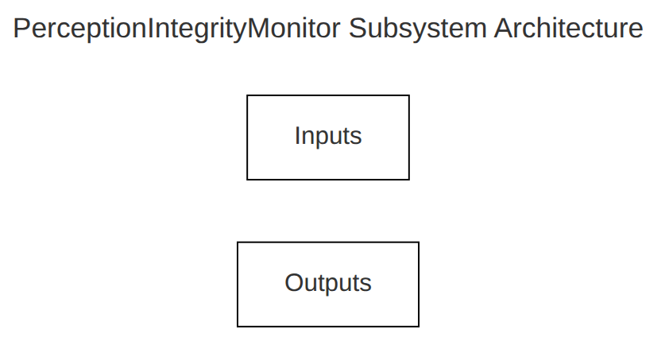
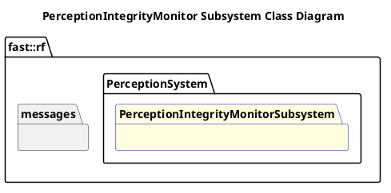

`@compare_tag Subsystem-Document v0.1`
[Perception System](../../../doc/System-Perception.md)

- [Subsystem: PerceptionIntegrityMonitor](#subsystem-cookiecuttersubsystem)
- [Overview](#overview)
  - [Purpose](#purpose)
  - [General Requirements](#general-requirements)
- [Subsystem Architecture](#subsystem-architecture)
  - [Class Diagram](#class-diagram)
- [Inputs](#inputs)
- [Outputs](#outputs)
- [How It Works](#how-it-works)
  - [Detailed Documentation](#detailed-documentation)
  - [Software Content](#software-content)
- [Processes](#processes)
  - [Package Diagram](#package-diagram)
- [Usage Instructions](#usage-instructions)
- [Validation](#validation)

# Subsystem: PerceptionIntegrityMonitor

# Overview

## Purpose

The PerceptionIntegrityMonitor Subsystem's role in the Robot Framework is to ???

## General Requirements

# Subsystem Architecture

## Class Diagram

# Inputs

The following inputs are required in order for this system to properly function.

| Input | DataType | Description | Requirement |
| ----- | -------- | ----------- | ----------- |

# Outputs

The following outputs are provided by this system.

| Output | DataType | Description | Usage |
| ------ | -------- | ----------- | ----- |

# How It Works

## Detailed Documentation

## Software Content

# Processes

| Status | Process |
| ------ | ------- |

## Package Diagram

# Usage Instructions

# Validation
