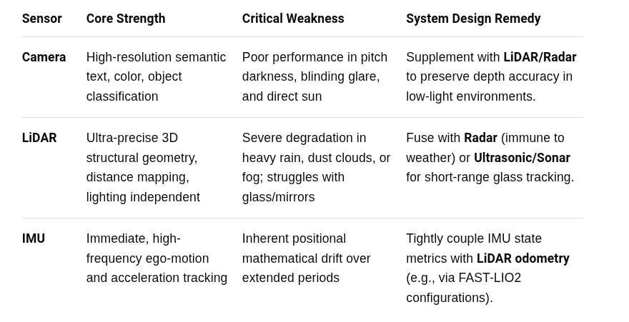
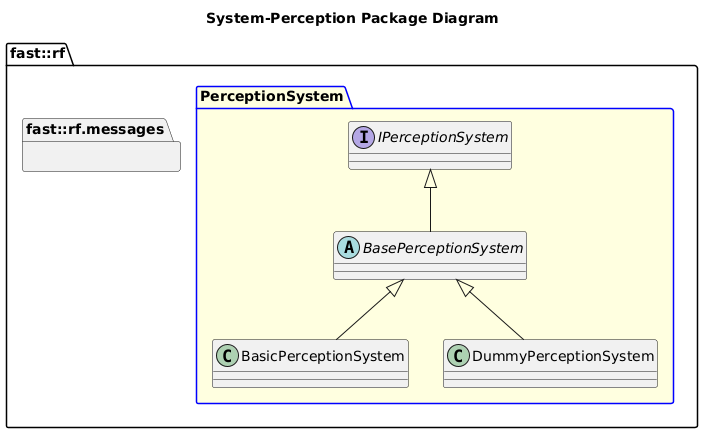

[README](../../../README.md)

[Architecture](../../../doc/Architecture/Architecture.md)

- [System: Perception](#system-perception)
- [Overview](#overview)
  - [Purpose](#purpose)
  - [General Requirements](#general-requirements)
- [System Architecture](#system-architecture)
- [Inputs](#inputs)
- [Outputs](#outputs)
- [How It Works](#how-it-works)
  - [Detailed Documentation](#detailed-documentation)
  - [Software Content](#software-content)
- [Subsystems](#subsystems)
  - [Package Diagram](#package-diagram)
- [Usage Instructions](#usage-instructions)
- [Validation](#validation)
- [References](#references)
  - [Videos](#videos)

# System: Perception

# Overview

## Purpose

The Perception System's role in the Robot Framework is to ???.

## General Requirements

# System Architecture

# Inputs

The following inputs are required in order for this system to properly function.

| Input | DataType | Description | Requirement |
| ----- | -------- | ----------- | ----------- |

# Outputs

The following outputs are provided by this system.

| Output | DataType | Description | Usage |
| ------ | -------- | ----------- | ----- |

# How It Works

Ideas:

- Camera
- Lidar
- Radar
- Perception Fusion

Goals of the Perception System are to:
1. Output a list of objects in the machine's surroundings
2. Output a map of the environment around the machine
3. Compute a pose based off the perceived environment
## Detailed Documentation

s
## Software Content

# Subsystems

The following Subsystems are provided in this System:
| State | Subsystem | Purpose |
| ----- | --------- | ------- |

## Package Diagram

# Usage Instructions

# Validation

# References
## Videos
- https://www.youtube.com/watch?v=L3cdMDIJqWs
- https://www.youtube.com/watch?v=_7zTL4If-Uw
- https://www.youtube.com/watch?v=UesfMYM4qcc
- https://www.youtube.com/watch?v=YoO5t7Lpl74