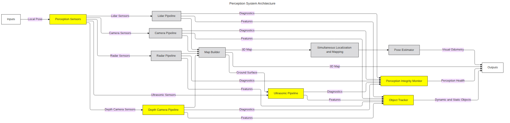
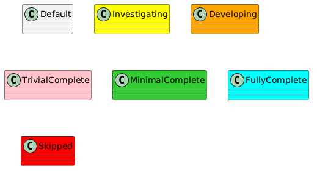
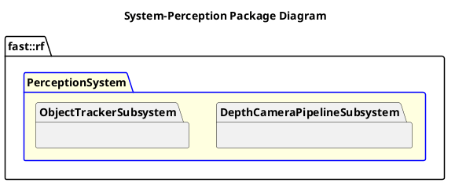

`@compare_tag System-Document v0.1`
[README](../../../README.md)

[Architecture](../../../doc/Architecture/Architecture.md)

- [System: Perception](#system-perception)
- [Overview](#overview)
  - [Purpose](#purpose)
  - [General Requirements](#general-requirements)
- [System Architecture](#system-architecture)
- [Inputs](#inputs)
- [Outputs](#outputs)
- [How It Works](#how-it-works)
  - [Questions](#questions)
  - [Ideas](#ideas)
      - [Ultrasonic Pipeline](#ultrasonic-pipeline)
    - [SLAM](#slam)
    - [Pose Estimator](#pose-estimator)
  - [Detailed Documentation](#detailed-documentation)
  - [Software Content](#software-content)
- [Subsystems](#subsystems)
  - [Package Diagram](#package-diagram)
- [Usage Instructions](#usage-instructions)
- [Validation](#validation)
- [References](#references)
  - [Interfaces](#interfaces)
  - [Videos](#videos)

# System: Perception

# Overview

## Purpose

The Perception System's role in the Robot Framework is to ???.

## General Requirements

# System Architecture

# Inputs

The following inputs are required in order for this system to properly function.

| Input | DataType | Description | Requirement |
| ----- | -------- | ----------- | ----------- |

# Outputs

The following outputs are provided by this system.

| Output                   | DataType | Description                        | Usage |
| ------------------------ | -------- | ---------------------------------- | ----- |
| Objects                  |          | Objects in the robot's vicinity.   |       |
| Local Map                |          | A map built solely from Perception |       |
| Perception computed Pose |          | Perception generated Pose          |       |

Additionally various channels are published by modules that is typically internal data that is sent to the outside world for system inspection and troubleshooting.

# How It Works

## Questions

## Ideas

#### Ultrasonic Pipeline
- Feeds object tracking in near environment.  Sensor modality dictates that what it detects is more like "something is near me"
- Should this interface with Map Building?
- Doesn't an Ultrasonic Sensor in principle look like a curved pointcloud circular wall of with a radious of the distance to the detected object and a size fo the sensor FOV

### SLAM

### Pose Estimator
- Is this part of SLAM?
## Detailed Documentation

## Software Content

# Subsystems

The following Subsystems are provided in this System:
| State | Subsystem                                                                                                            | Purpose                                                                                                                                                                      |
| ----- | -------------------------------------------------------------------------------------------------------------------- | ---------------------------------------------------------------------------------------------------------------------------------------------------------------------------- |
| READY | Perception Sensors                                                                                                   | These are vendor supplied content.  Translators to FAST friendly interfaces should be created as needed, but in general this content will be out of scope of this framework. |
| NEW   | [Depth Camera Pipeline](../Subsystems/DepthCameraPipeline/doc/Subsystem-DepthCameraPipeline.md)                      | The Depth Camera Pipeline is used to process Depth Camera data.                                                                                                              |
| NEW   | [Object Tracker](../Subsystems/ObjectTracker/doc/Subsystem-ObjectTracker.md)                                         | The Object Tracker creates and tracks objects.                                                                                                                               |
| NEW   | [Perception Integrity Monitor](../Subsystems/PerceptionIntegrityMonitor/doc/Subsystem-PerceptionIntegrityMonitor.md) | Analyzes the state of the entire Perception System.                                                                                                                          |
| NEW   | [Ultrasonic Pipeline](../Subsystems/UltrasonicPipeline/doc/Subsystem-UltrasonicPipeline.md)                          | The Ultrasonic Pipeline is used to process Ultrasonic Data.                                                                                                                  |

## Package Diagram

# Usage Instructions

# Validation

# References
## Interfaces
- sensor_msgs/msg/PointCloud2
## Videos
- https://www.youtube.com/watch?v=L3cdMDIJqWs
- https://www.youtube.com/watch?v=_7zTL4If-Uw
- https://www.youtube.com/watch?v=UesfMYM4qcc
- https://www.youtube.com/watch?v=YoO5t7Lpl74