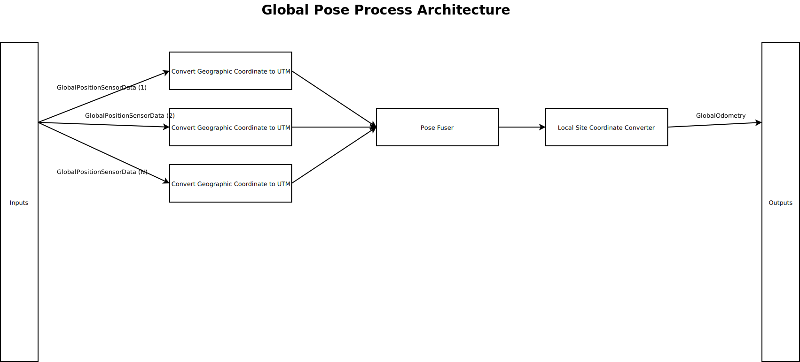
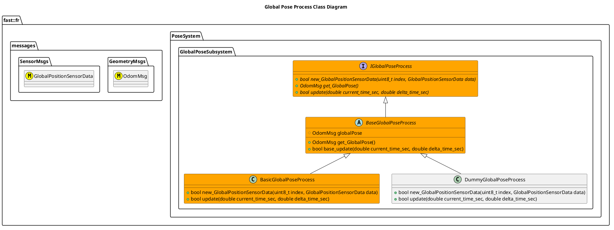

[Global Pose Subsystem](../../../doc/Subsystem-GlobalPose.md)

- [Process: Global Pose](#process-global-pose)
- [Document History](#document-history)
- [Overview](#overview)
  - [Purpose](#purpose)
  - [General Requirements](#general-requirements)
- [Process Architecture](#process-architecture)
- [Inputs](#inputs)
- [Outputs](#outputs)
- [How It Works](#how-it-works)
  - [Detailed Documentation](#detailed-documentation)
  - [Class Diagram](#class-diagram)
  - [Global Pose Process Implementations](#global-pose-process-implementations)
- [Usage Instructions](#usage-instructions)
- [Validation](#validation)

# Process: Global Pose

# Document History

| Version Number | Date         | Author     | Change           |
| :------------: | ------------ | ---------- | ---------------- |
|       0        | 25-June-2026 | David Gitz | Drafted Document |

# Overview

## Purpose

This process's objective is to take, given multiple streams of GPS data, a combined GlobalPose.

## General Requirements

# Process Architecture

# Inputs

The following inputs are required in order for this system to properly function.

| Input                           | DataType                | Description                             | Requirement                 |
| ------------------------------- | ----------------------- | --------------------------------------- | --------------------------- |
| GPS Sensor Data (Instances 1-N) | GlobalPositionSensorMsg | Position data in Geographic Coordinates | Interface spec is followed. |

# Outputs

The following outputs are provided by this system.

| Output         | DataType | Description                   | Usage                                                                                                                                       |
| -------------- | -------- | ----------------------------- | ------------------------------------------------------------------------------------------------------------------------------------------- |
| GlobalOdometry | OdomMsg  | Singular Global Pose of robot | Best estimate of Global Pose. Note that this position may have discontinuties due to the nature of the GPS System, i.e. it is not "Smooth". |

# How It Works

## Detailed Documentation

## Class Diagram

## Global Pose Process Implementations

| Status | Implementation                                                              | Details                             |
| ------ | --------------------------------------------------------------------------- | ----------------------------------- |
| NEW    | DummyGlobalPoseProcess                                                      | Used for generating fake data       |
| DRAFT  | [BasicGlobalPoseProcess](ProcessImplementations/Process-BasicGlobalPose.md) | Trivial implentation, very limited. |

# Usage Instructions

# Validation
