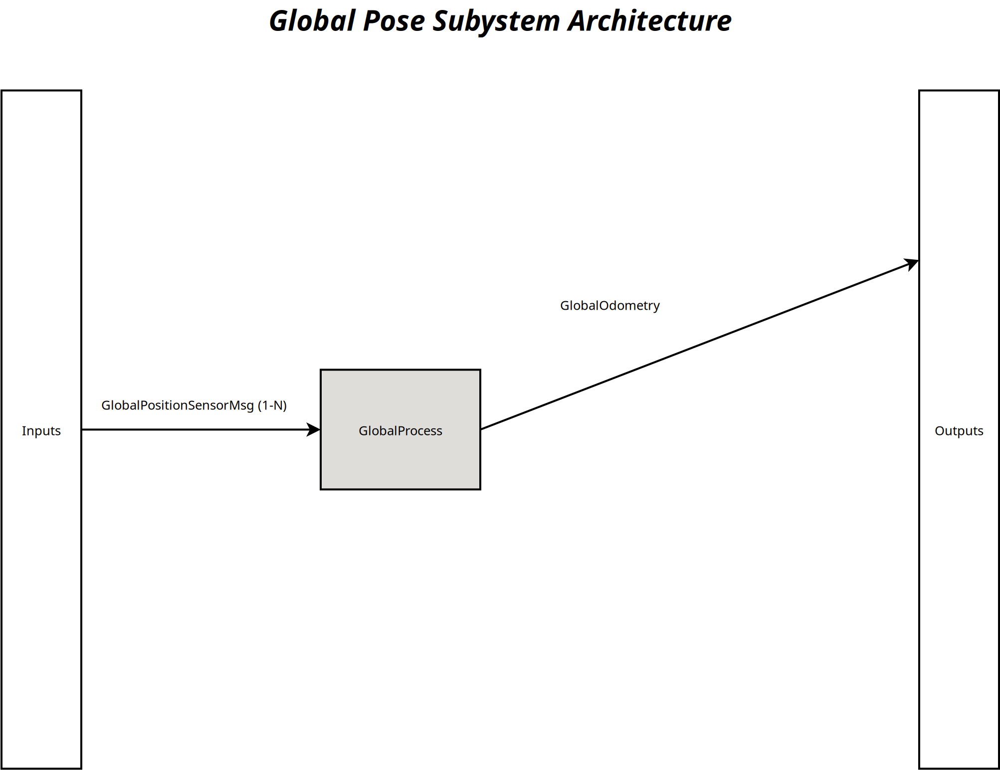

[Pose System](../../../doc/System-Pose.md)

- [Subsystem: Global Pose](#subsystem-global-pose)
- [Document History](#document-history)
- [Overview](#overview)
  - [Purpose](#purpose)
  - [General Requirements](#general-requirements)
- [Subsystem Architecture](#subsystem-architecture)
- [Inputs](#inputs)
- [Outputs](#outputs)
- [How It Works](#how-it-works)
  - [Detailed Documentation](#detailed-documentation)
  - [Software Content](#software-content)
- [Processes](#processes)
  - [Package Diagram](#package-diagram)
- [Usage Instructions](#usage-instructions)
- [Validation](#validation)

# Subsystem: Global Pose

# Document History

| Version Number | Date         | Author     | Change           |
| :------------: | ------------ | ---------- | ---------------- |
|       0        | 24-June-2026 | David Gitz | Drafted Document |

# Overview

## Purpose

The Global Pose Subsystem's role in the Robot Framework is to take available Global Sensor data and combine to form a single coherent global Pose Estimate of the robot.

## General Requirements

# Subsystem Architecture

# Inputs

The following inputs are required in order for this system to properly function.

| Input            | DataType         | Description                        | Requirement                                                                                  |
| ---------------- | ---------------- | ---------------------------------- | -------------------------------------------------------------------------------------------- |
| GPS Sensor (1-N) | GlobalSensorData | Global Position Sensor Data input. | The Global Sensor Subsystem should ensure that the data follows the interface specification. |

# Outputs

The following outputs are provided by this system.

| Output         | DataType | Description                               | Usage |
| -------------- | -------- | ----------------------------------------- | ----- |
| GlobalOdometry | OdomMsg  | Singular Global Pose for the Ego Machine. |       |

# How It Works

## Detailed Documentation

## Software Content

# Processes

| Status | Process                                                                         |
| ------ | ------------------------------------------------------------------------------- |
| DRAFT  | [Global Pose Process](../Processes/GlobalPoseProcess/doc/Process-GlobalPose.md) |

## Package Diagram

# Usage Instructions

# Validation
