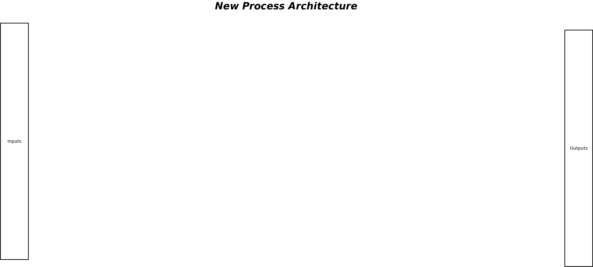
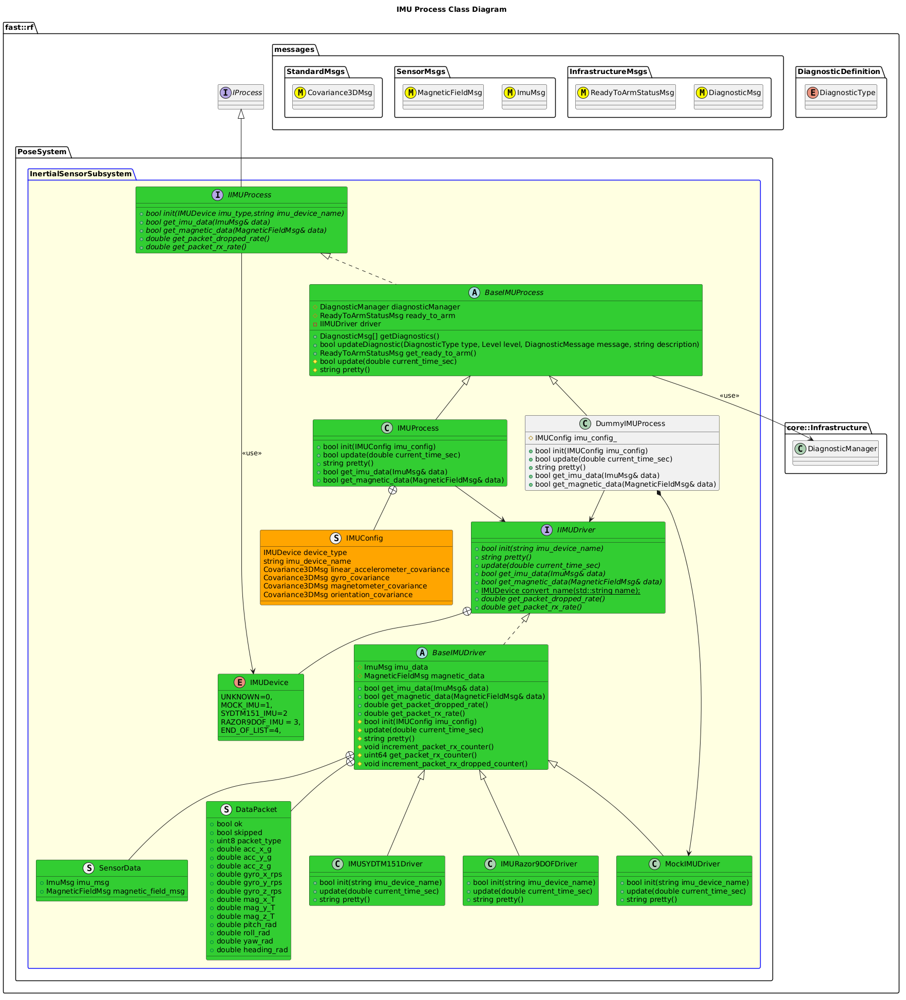

[InertialSensor Subsystem](../../../doc/Subsystem-InertialSensor.md)

- [Process: IMU](#process-imu)
- [Todo during AB#1732](#todo-during-ab1732)
- [Overview](#overview)
  - [Purpose](#purpose)
  - [General Requirements](#general-requirements)
- [Process Architecture](#process-architecture)
- [Inputs](#inputs)
- [Outputs](#outputs)
- [How It Works](#how-it-works)
  - [Detailed Documentation](#detailed-documentation)
  - [Class Diagram](#class-diagram)
  - [Diagnostics](#diagnostics)
  - [Other IMU Process Implementation](#other-imu-process-implementation)
- [Usage Instructions](#usage-instructions)
  - [Artifacts Provided](#artifacts-provided)
  - [Test Executable](#test-executable)
  - [Integration Steps](#integration-steps)
    - [Build Instructions](#build-instructions)
    - [Code Instructions](#code-instructions)
- [Validation](#validation)

# Process: IMU

# Todo during AB#1732
- Consider a buffer for IMU Data instead of singular data
- How to get "new" data?  a tuple return ("new", and imu data)?
- Create test executable for driver
# Overview

## Purpose

This process's objective is to ???.

## General Requirements

# Process Architecture



# Inputs

The following inputs are required in order for this system to properly function.

| Input | DataType | Description | Requirement |
| ----- | -------- | ----------- | ----------- |

# Outputs

The following outputs are provided by this system.

| Output        | DataType           | Description | Usage |
| ------------- | ------------------ | ----------- | ----- |
| IMU Data      | `ImuMsg`           |             |       |
| Magnetic Data | `MagneticFieldMsg` |             |       |

# How It Works

## Detailed Documentation


## Class Diagram



## Diagnostics
The following Diagnostics are reported by this Process:
| Diagnostic Type | Description                |
| --------------- | -------------------------- |
| `SOFTWARE`      | Software Diagnostics       |
| `SENSORS`       | General Sensor Diagnostics |

## Other IMU Process Implementation

| Status | Implementation  | Details                       |
| ------ | --------------- | ----------------------------- |
| NEW    | DummyIMUProcess | Used for generating fake data |


# Usage Instructions

## Artifacts Provided
The following artifacts are provided:
| Artifact     | Description                                      |
| ------------ | ------------------------------------------------ |
| `imuProcess` | General Library that provides this functionality |


## Test Executable
A Test Executable is provided.  

To use this, after building/installing, run the following:
```bash
./install/bin/exec_imudriver -l <Logger Level (DEBUG=2--> FATAL=7)> -d <Driver Version.  1-Mock IMU.  2- SYD TM151>
```


## Integration Steps
### Build Instructions
Add the following to your CMakeLists.txt file:
```cmake
target_link_libraries(<binary> <blah> imuProcess)
```


### Code Instructions
NOTE: Consult this module's API-TODO when in doubt.

Add the following to your header:

```cpp
#include <ServoHatDriverProcess/ServoHatDriverProcess.hpp>
...
fast::rf::PoseSystem::InertialSensorSubsystem::IMUProcess
            process;  //!< Execution Process
```

Add the following to your implementation:
```cpp
// Initialize:
process.init(<IMU Type>);

// Update the process at a periodic rate
process.update(now) // Some current timestamp

// Get Data from it
```


# Validation
