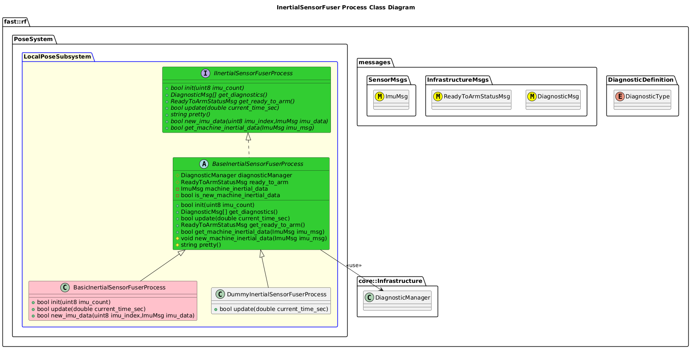

`@compare_tag Process-Document v0.1`
[LocalPose Subsystem](../../../doc/Subsystem-LocalPose.md)

- [Process: InertialSensorFuser](#process-inertialsensorfuser)
- [Overview](#overview)
  - [Purpose](#purpose)
  - [General Requirements](#general-requirements)
- [Inputs](#inputs)
- [Outputs](#outputs)
- [Diagnostics](#diagnostics)
- [How It Works](#how-it-works)
  - [Detailed Documentation](#detailed-documentation)
  - [Class Diagram](#class-diagram)
  - [InertialSensorFuser Process Implementation](#inertialsensorfuser-process-implementation)
- [Usage Instructions](#usage-instructions)
- [Validation](#validation)

# Process: InertialSensorFuser

# Overview

## Purpose

This process's objective is to combine multiple IMU Sensor's into one singular IMU reading for an entire machine.

## General Requirements

# Inputs

The following inputs are required in order for this system to properly function.

| Input                 | DataType       | Description                             | Requirement |
| --------------------- | -------------- | --------------------------------------- | ----------- |
| IMU Sensor (multiple) | SensorMsgs/Imu | Multiple IMU Sensors installed on Robot |             |

# Outputs

The following outputs are provided by this system.

| Output      | DataType       | Description         | Usage |
| ----------- | -------------- | ------------------- | ----- |
| Machine IMU | SensorMsgs/Imu | Aggregated IMU Data |       |

# Diagnostics
Processes in this Subsystem are defined by:
- System: TODO
- Subsystem: TODO
- Process: TODO

The following Diagnostics are reported by this Process:
| Diagnostic Type | Description |
| --------------- | ----------- |

# How It Works

## Detailed Documentation

## Class Diagram

## InertialSensorFuser Process Implementation

| Status | Implementation                                                                                       | Details                                                   |
| ------ | ---------------------------------------------------------------------------------------------------- | --------------------------------------------------------- |
| NEW    | DummyInertialSensorFuserProcess                                                                      | Used for generating fake data                             |
| NEW    | [BasicInertialSensorFuserProcess](../doc/ProcessImplementations/Process-BasicInertialSensorFuser.md) | Trivial Impelemntation.  This essentially is a pass-thru. |

# Usage Instructions

# Validation
