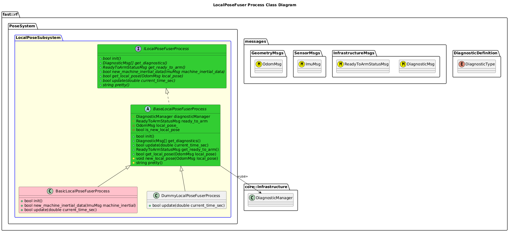

`@compare_tag Process-Document v0.1`
[LocalPose Subsystem](../../../doc/Subsystem-LocalPose.md)

- [Process: LocalPoseFuser](#process-localposefuser)
- [Overview](#overview)
  - [Purpose](#purpose)
  - [General Requirements](#general-requirements)
- [Inputs](#inputs)
- [Outputs](#outputs)
- [Diagnostics](#diagnostics)
- [How It Works](#how-it-works)
  - [Detailed Documentation](#detailed-documentation)
  - [Class Diagram](#class-diagram)
  - [LocalPoseFuser Process Implementation](#localposefuser-process-implementation)
- [Usage Instructions](#usage-instructions)
- [Validation](#validation)

# Process: LocalPoseFuser

# Overview

## Purpose

This process's objective is to ???.

## General Requirements

# Inputs

The following inputs are required in order for this system to properly function.

| Input | DataType | Description | Requirement |
| ----- | -------- | ----------- | ----------- |

# Outputs

The following outputs are provided by this system.

| Output | DataType | Description | Usage |
| ------ | -------- | ----------- | ----- |

# Diagnostics
Processes in this Subsystem are defined by:
- System: TODO
- Subsystem: TODO
- Process: TODO

The following Diagnostics are reported by this Process:
| Diagnostic Type | Description |
| --------------- | ----------- |

# How It Works

## Detailed Documentation

## Class Diagram

## LocalPoseFuser Process Implementation

| Status | Implementation                                                                             | Details                                            |
| ------ | ------------------------------------------------------------------------------------------ | -------------------------------------------------- |
| NEW    | DummyLocalPoseFuserProcess                                                                 | Used for generating fake data                      |
| NEW    | [BasicLocalPoseFuserProcess](../doc/ProcessImplementations/Process-BasicLocalPoseFuser.md) | This is a trivial implemention.  Mainly pass-thru. |

# Usage Instructions

# Validation
