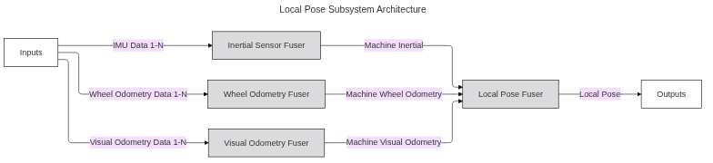
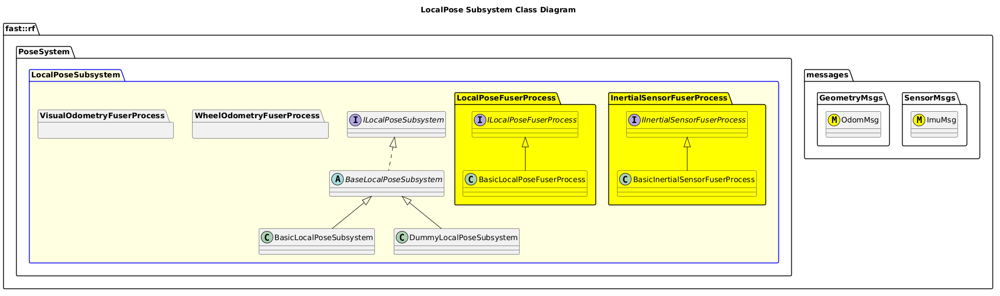

[Pose System](../../../doc/System-Pose.md)

- [Subsystem: LocalPose](#subsystem-localpose)
- [Overview](#overview)
  - [Purpose](#purpose)
  - [General Requirements](#general-requirements)
- [Subsystem Architecture](#subsystem-architecture)
  - [Class Diagram](#class-diagram)
- [Inputs](#inputs)
- [Outputs](#outputs)
- [How It Works](#how-it-works)
  - [Detailed Documentation](#detailed-documentation)
  - [Software Content](#software-content)
- [Processes](#processes)
  - [Package Diagram](#package-diagram)
- [Usage Instructions](#usage-instructions)
- [Validation](#validation)

# Subsystem: LocalPose

# Overview

## Purpose

The LocalPose Subsystem's role in the Robot Framework is to compute a Local Pose that is continuous.

## General Requirements

# Subsystem Architecture

## Class Diagram

# Inputs

The following inputs are required in order for this system to properly function.

| Input    | DataType       | Description                        | Requirement                 |
| -------- | -------------- | ---------------------------------- | --------------------------- |
| IMU Data | SensorMsgs/Imu | IMU Sensor Data.  May be multiple. | Follows Reference Standards |

# Outputs

The following outputs are provided by this system.

| Output     | DataType         | Description         | Usage |
| ---------- | ---------------- | ------------------- | ----- |
| Local Pose | NavMsgs/Odometry | Local Pose Odometry |       |

# How It Works

## Detailed Documentation

## Software Content

# Processes

| Status | Process                                                                                              |
| ------ | ---------------------------------------------------------------------------------------------------- |
| DRAFT  | [Inertial Sensor Fuser Process](../Processes/InertialSensorFuser/doc/Process-InertialSensorFuser.md) |
| NEW    | Wheel Odometry Fuser Process                                                                         |
| NEW    | Visual Odometry Fuser Process                                                                        |
| DRAFT  | [Local Pose Fuser Process](../Processes/LocalPoseFuser/doc/Process-LocalPoseFuser.md)                |  |

## Package Diagram

# Usage Instructions

# Validation
