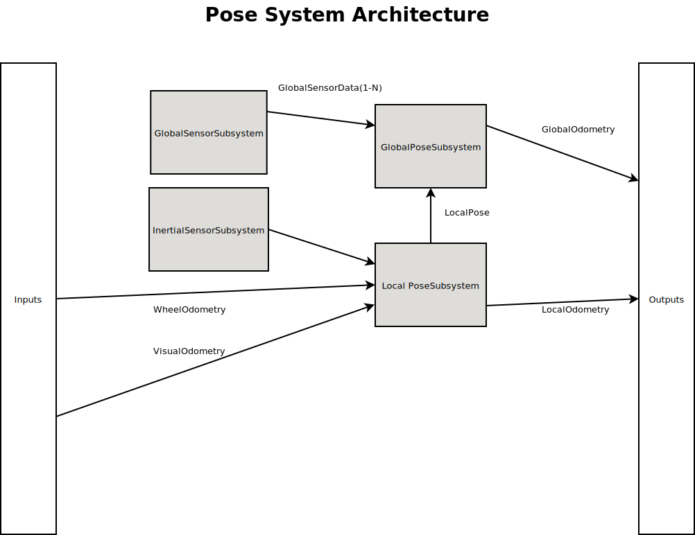
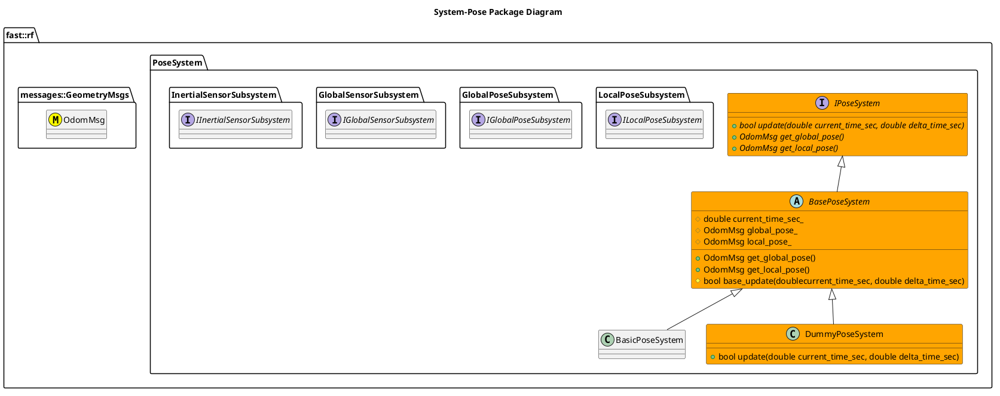

[README](../../../README.md)

[Architecture](../../../doc/Architecture/Architecture.md)

- [System: Pose](#system-pose)
- [Document History](#document-history)
- [Overview](#overview)
  - [Purpose](#purpose)
  - [General Requirements](#general-requirements)
- [System Architecture](#system-architecture)
- [Inputs](#inputs)
- [Outputs](#outputs)
- [How It Works](#how-it-works)
  - [Detailed Documentation](#detailed-documentation)
  - [Software Content](#software-content)
- [Subsystems](#subsystems)
  - [Package Diagram](#package-diagram)
- [Usage Instructions](#usage-instructions)
- [Validation](#validation)

# System: Pose

# Document History

| Version Number | Date         | Author     | Change           |
| :------------: | ------------ | ---------- | ---------------- |
|       0        | 23-June-2026 | David Gitz | Drafted Document |

# Overview

## Purpose

The Awareness System's role in the Robot Framework is to compute the Pose of a robot.

## General Requirements

# System Architecture

# Inputs

The following inputs are required in order for this system to properly function.

| Input | DataType | Description | Requirement |
| ----- | -------- | ----------- | ----------- |

# Outputs

The following outputs are provided by this system.

| Output | DataType | Description | Usage |
| ------ | -------- | ----------- | ----- |

# How It Works

## Detailed Documentation

## Software Content

# Subsystems

The following Subsystems are provided in this System:
| State | Subsystem | Purpose |
| --- | --- | --- |
| NEW | [Inertial Sensors](../Subsystems/InertialSensorSubsystem/doc/Subsystem-InertialSensor.md) | |
| NEW | [Global Sensors](../Subsystems/GlobalSensorSubsystem/doc/Subsystem-GlobalSensor.md) | |
| NEW | [Global Pose](../Subsystems/GlobalPoseSubsystem/doc/Subsystem-GlobalPose.md) | |
| NEW | [Local Pose](../Subsystems/LocalPoseSubsystem/doc/Subsystem-LocalPose.md) | |

## Package Diagram

# Usage Instructions

Typically the software provided directly in this System is not used, but instead is used at the Process level. However for validation purposes abstract classes are provided to test interface connectivity.

# Validation
