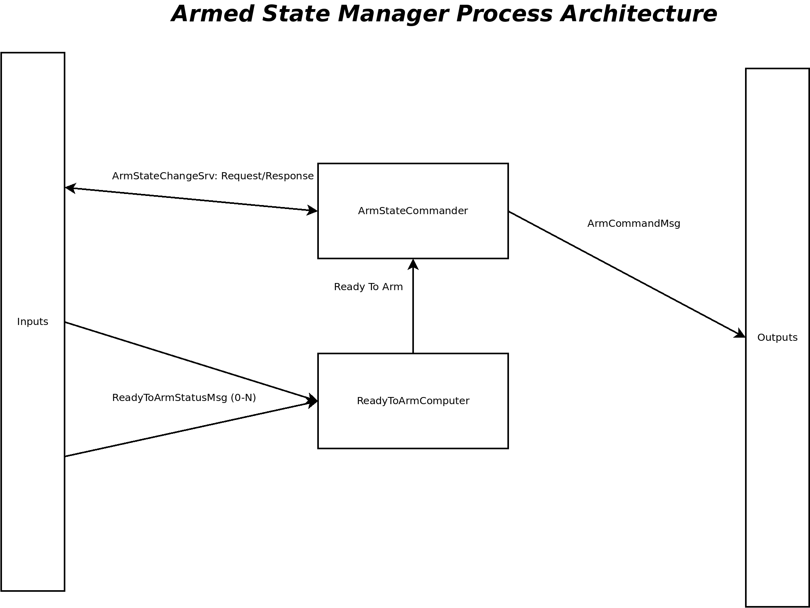
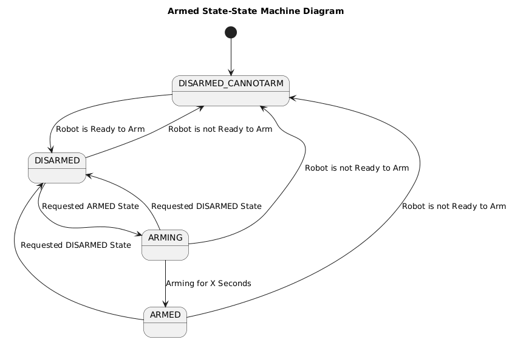
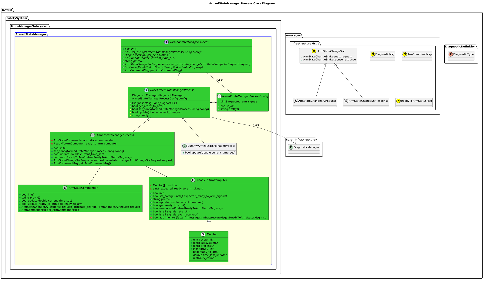
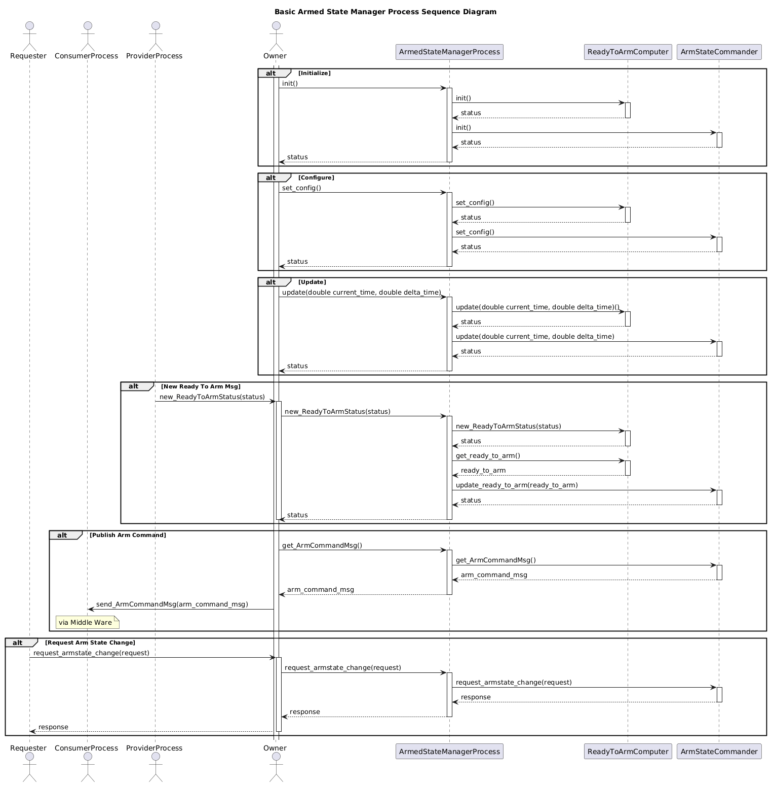

[ModeManager Subsystem](../../../doc/Subsystem-ModeManager.md)

- [Process: ArmedStateManager](#process-armedstatemanager)
- [Overview](#overview)
  - [Purpose](#purpose)
  - [General Requirements](#general-requirements)
- [Process Architecture](#process-architecture)
- [Inputs](#inputs)
- [Outputs](#outputs)
- [How It Works](#how-it-works)
  - [Detailed Documentation](#detailed-documentation)
  - [Class Diagram](#class-diagram)
  - [Sequence Diagram](#sequence-diagram)
  - [Diagnostics](#diagnostics)
  - [Functionality](#functionality)
    - [Monitor Ready to Arm Status Messages](#monitor-ready-to-arm-status-messages)
    - [Arm Change Service](#arm-change-service)
    - [Publish Arm Command Message](#publish-arm-command-message)
- [Other ArmedStateManager Process Implementation's](#other-armedstatemanager-process-implementations)
- [Usage Instructions](#usage-instructions)
  - [Artifacts Provided](#artifacts-provided)
  - [Integration Steps](#integration-steps)
    - [Build Instructions](#build-instructions)
    - [Code Instructions](#code-instructions)
- [Validation](#validation)

# Process: ArmedStateManager

# Overview

## Purpose

This process's objective is to continually evaluate the status of the robot along with whatever arm change request is received, and compute an Arm Command.

## General Requirements

# Process Architecture



# Inputs

The following inputs are required in order for this system to properly function.

| Input                 | DataType              | Description                                                                                                                              | Requirement |
| --------------------- | --------------------- | ---------------------------------------------------------------------------------------------------------------------------------------- | ----------- |
| Arm Change Request    | `ArmStateChangeSrv`   | A Service (request/response) that is used to request a change in the armed state of the robot.                                           |             |
| Ready To Arm Messages | `ReadyToArmStatusMsg` | A message that is provided by other processes that indicates if they are ready to arm.  Note that typically there will be many of these. |             |

# Outputs

The following outputs are provided by this system.

| Output      | DataType        | Description              | Usage                                                                                         |
| ----------- | --------------- | ------------------------ | --------------------------------------------------------------------------------------------- |
| Arm Command | `ArmCommandMsg` | The commanded Arm state. | Typically used by things that manipulate the robot's phyiscal environment, such as actuators. |

# How It Works

## Detailed Documentation




## Class Diagram



## Sequence Diagram


## Diagnostics
The following Diagnostics are reported by this Process:
| Diagnostic Type  | Description                                                                    |
| ---------------- | ------------------------------------------------------------------------------ |
| `SOFTWARE`       | General Software readiness                                                     |
| `COMMUNICATIONS` | Un-trips when all Ready to Arm messages are being received at a regular basis. |


## Functionality
### Monitor Ready to Arm Status Messages
The Armed State Manager is configured to listen to specific combinations of System, Subsystems and Components.  These other processes are responsible for publishing a Ready to Arm Status message with the details if they believe they are working fine enough to arm the robot.  This will then get passes to a sub library that continually listens to all of these messages and computes a general Read to Arm Status for the Robot itself.  This library will also be continually updated, and if it doesn't receive a Ready to Arm Status from one of these processes in a certain allowed period of time, it will assume that process is offline and act accordingly.

### Arm Change Service
The Arm State Manager will receive a request to change the Armed State.  Based on its information, it will reply to the request if the state change is approved, along with the new state.  Note that this service can also be used to request the current state (i.e. no state change required).

### Publish Arm Command Message
The Armed State Manager will continually publish the Arm Command Message.  This indicates the actual Armed State that will be commanded by the robot.  It's a single trusted source of truth for the robot.


# Other ArmedStateManager Process Implementation's

| Status | Implementation                | Details                       |
| ------ | ----------------------------- | ----------------------------- |
| NEW    | DummyArmedStateManagerProcess | Used for generating fake data |

# Usage Instructions
## Artifacts Provided
The following artifacts are provided:
| Artifact                   | Description                                      |
| -------------------------- | ------------------------------------------------ |
| `armedStateManagerProcess` | General Library that provides this functionality |


## Integration Steps

### Build Instructions
Add the following to your CMakeLists.txt file:
```cmake
target_link_libraries(<binary> <blah> armedStateManagerProcess)
```

### Code Instructions
NOTE: Consult this module's API-TODO when in doubt.

Add the following to your header:

```cpp
#include <ArmedStateManagerProcess.hpp>
...
fast::rf::SafetySystem::ModeManagerSubsystem::ArmedStateManagerProcess process;  //!< Execution Process
```

Add the following to your implementation:
```cpp
// Initialize:
process.init();

// Update the process at a periodic rate
process.update(now) // Some current timestamp

// Provide it new Ready To Arm Messages
process.new_ReadyToArmStatus(msg)

// Handle Arm State Change Request/Response Service
auto response = process.request_armstate_change(request)

// Get the latest Arm State Command for the Robot and Publish
auto arm_command = process.get_ArmCommandMsg()
```


See the API for more detail, how to inspect diagnostics, etc.
# Validation
This module and related classes are entirely validated thru Unit Tests.