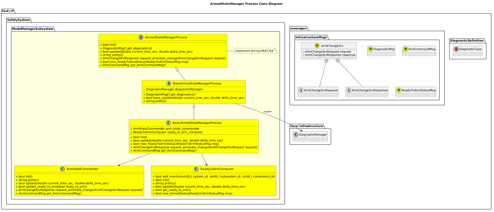
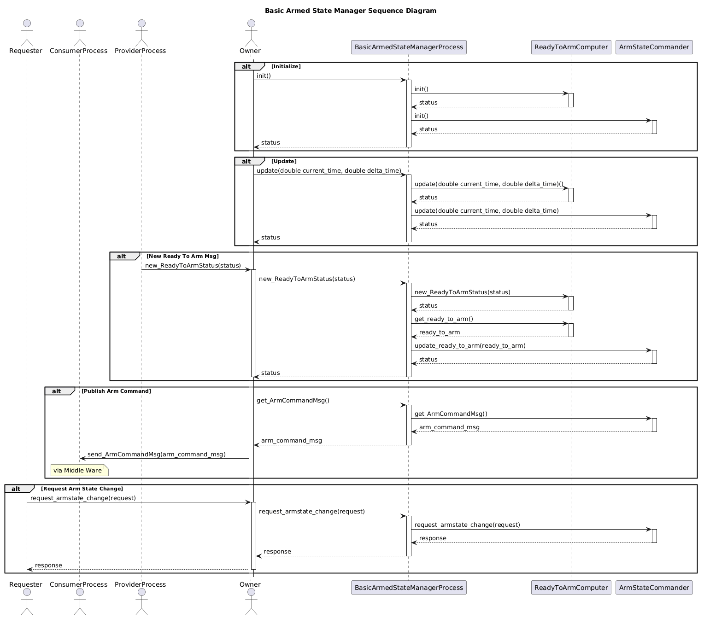

[ArmedStateManager Process](../Process-ArmedStateManager.md)

- [Process Implementation: ArmedStateManager](#process-implementation-armedstatemanager)
- [Overview](#overview)
  - [Purpose](#purpose)
  - [General Requirements](#general-requirements)
  - [Limitations](#limitations)
- [Process Architecture](#process-architecture)
- [Inputs](#inputs)
- [Outputs](#outputs)
- [How It Works](#how-it-works)
  - [Detailed Documentation](#detailed-documentation)
  - [Class Diagram](#class-diagram)
  - [Sequence Diagram](#sequence-diagram)
  - [Diagnostics](#diagnostics)
  - [Functionality](#functionality)
    - [Monitor Ready to Arm Status Messages](#monitor-ready-to-arm-status-messages)
    - [Arm Change Service](#arm-change-service)
    - [Publish Arm Command Message](#publish-arm-command-message)
- [Usage Instructions](#usage-instructions)
  - [Artifacts Provides](#artifacts-provides)
  - [Integration Steps](#integration-steps)
- [Validation](#validation)

# Process Implementation: ArmedStateManager

# Overview

## Purpose

This specific Process Implementation provides ???

## General Requirements

## Limitations

The following are a listing of all limitations in this module:

# Process Architecture

# Inputs
See: [Process Inputs](../Process-ArmedStateManager.md#inputs) 
The following inputs are required in order for this system to properly function.

# Outputs
See: [Process Outputs](../Process-ArmedStateManager.md#outputs) 

# How It Works

## Detailed Documentation

## Class Diagram

## Sequence Diagram

## Diagnostics
The following Diagnostics are reported by this Process:
| Diagnostic Type | Description |
| --------------- | ----------- |

## Functionality
### Monitor Ready to Arm Status Messages
The Armed State Manager is configured to listen to specific combinations of System, Subsystems and Components.  These other processes are responsible for publishing a Ready to Arm Status message with the details if they believe they are working fine enough to arm the robot.  This will then get passes to a sub library that continually listens to all of these messages and computes a general Read to Arm Status for the Robot itself.  This library will also be continually updated, and if it doesn't receive a Ready to Arm Status from one of these processes in a certain allowed period of time, it will assume that process is offline and act accordingly.

### Arm Change Service
The Arm State Manager will receive a request to change the Armed State.  Based on its information, it will reply to the request if the state change is approved, along with the new state.  Note that this service can also be used to request the current state (i.e. no state change required).

### Publish Arm Command Message
The Armed State Manager will continually publish the Arm Command Message.  This indicates the actual Armed State that will be commanded by the robot.  It's a single trusted source of truth for the robot.

# Usage Instructions

## Artifacts Provides
The following artifacts are provided:
| Artifact                         | Description                                      |
| -------------------------------- | ------------------------------------------------ |
| `basic_ArmedStateManagerProcess` | General Library that provides this functionality |

## Integration Steps

# Validation
