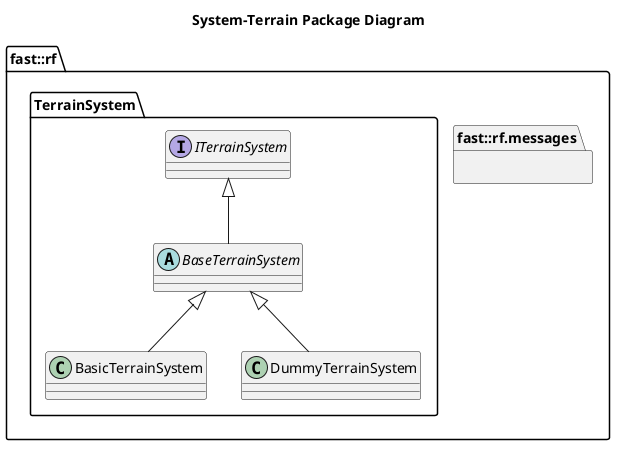

[README](../../../README.md)

[Architecture](../../../doc/Architecture/Architecture.md)

- [System: Terrain](#system-terrain)
- [Document History](#document-history)
- [Overview](#overview)
  - [Purpose](#purpose)
  - [General Requirements](#general-requirements)
- [System Architecture](#system-architecture)
- [Inputs](#inputs)
- [Outputs](#outputs)
- [How It Works](#how-it-works)
  - [Detailed Documentation](#detailed-documentation)
  - [Software Content](#software-content)
- [Subsystems](#subsystems)
  - [Package Diagram](#package-diagram)
- [Usage Instructions](#usage-instructions)
- [Validation](#validation)

# System: Terrain

# Document History

| Version Number | Date | Author | Change |
| :------------: | ---- | ------ | ------ |

# Overview

## Purpose

The Terrain System's role in the Robot Framework is to ???.

## General Requirements

# System Architecture

# Inputs

The following inputs are required in order for this system to properly function.

| Input | DataType | Description | Requirement |
| ----- | -------- | ----------- | ----------- |

# Outputs

The following outputs are provided by this system.

| Output | DataType | Description | Usage |
| ------ | -------- | ----------- | ----- |

# How It Works

## Detailed Documentation

## Software Content

# Subsystems

The following Subsystems are provided in this System:
| State | Subsystem | Purpose |
| --- | --- | --- |

## Package Diagram

# Usage Instructions

# Validation
