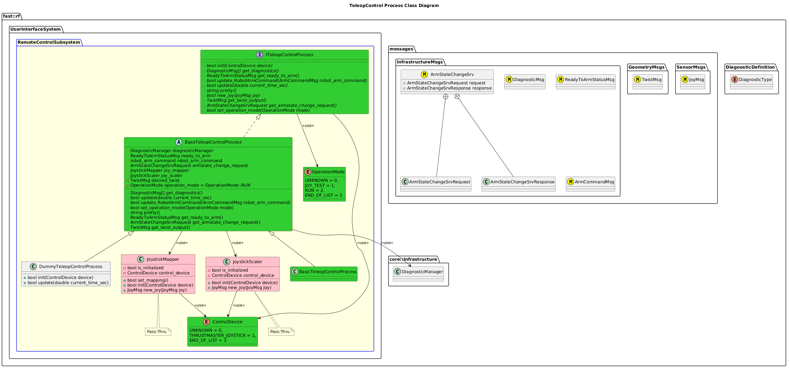

`@compare_tag Process-Document`
[RemoteControl Subsystem](../../../doc/Subsystem-RemoteControl.md)

- [Process: TeleopControl](#process-teleopcontrol)
- [Overview](#overview)
  - [Purpose](#purpose)
  - [General Requirements](#general-requirements)
- [Devices Supported](#devices-supported)
- [Inputs](#inputs)
- [Outputs](#outputs)
- [How It Works](#how-it-works)
  - [Detailed Documentation](#detailed-documentation)
  - [Class Diagram](#class-diagram)
  - [Components](#components)
    - [Component: Joystick Mapper](#component-joystick-mapper)
    - [Component: Scaler](#component-scaler)
    - [Component: Twist Computer](#component-twist-computer)
  - [TeleopControl Process Implementation](#teleopcontrol-process-implementation)
- [Usage Instructions](#usage-instructions)
- [Validation](#validation)

# Process: TeleopControl

# Overview

## Purpose

This process's objective is to take in Joystick Commands and convert to a standard Twist message.

## General Requirements

# Devices Supported
The following Devices are supported:
| Device                | ControlDevice Definition               |
| --------------------- | -------------------------------------- |
| Thrustmaster Joystick | `ControlDevice::THRUSTMASTER_JOYSTICK` |

# Inputs

The following inputs are required in order for this system to properly function.

| Input    | DataType | Description   | Requirement |
| -------- | -------- | ------------- | ----------- |
| Joystick | JoyMsg   | Joystick Data |             |

# Outputs

The following outputs are provided by this system.

| Output        | DataType | Description                                                  | Usage |
| ------------- | -------- | ------------------------------------------------------------ | ----- |
| Arm Command   | ?        | A command signal taken from the User to Arm/Disarm the Robot | ?     |
| Desired Twist | TwistMsg | A Desired Twist taken from some User Controller              |       |

# How It Works
Typically this Process will interface with some user hardware (joystick, keyboard, mouse, other hardware).

## Detailed Documentation

## Class Diagram

## Components
There are 3 main components of the Teleop Control Process:

### Component: Joystick Mapper
This component is responsible for taking the unique Joystick data (i.e. one Joystick vendor may propogate data in different vector indexes)

### Component: Scaler
This component is responsible for scaling all Joystick data to a common range.

### Component: Twist Computer
This component is responsible for taking the Joystick data and converting to a Twist Message.

## TeleopControl Process Implementation

| Status | Implementation                                                                           | Details                             |
| ------ | ---------------------------------------------------------------------------------------- | ----------------------------------- |
| NEW    | DummyTeleopControlProcess                                                                | Used for generating fake data       |
| DRAFT  | [BasicTeleopControlProcess](../doc/ProcessImplementations/Process-BasicTeleopControl.md) | Trivial implentation, very limited. |

# Usage Instructions

# Validation
