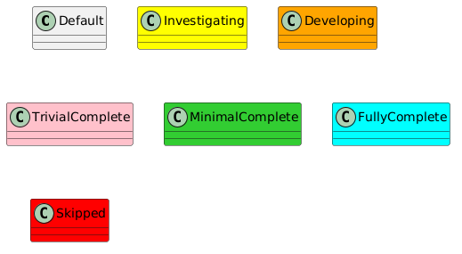
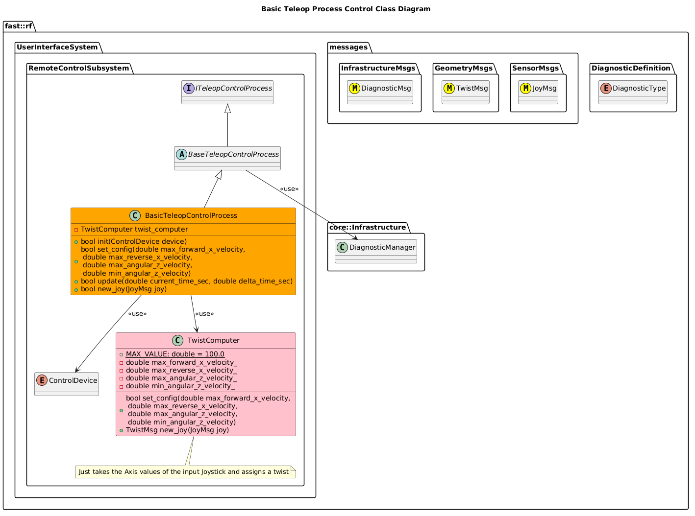

[TeleopControl Process](../Process-TeleopControl.md)

- [Process Implementation: TeleopControl](#process-implementation-teleopcontrol)
- [Document History](#document-history)
- [Overview](#overview)
  - [Purpose](#purpose)
  - [General Requirements](#general-requirements)
  - [Limitations](#limitations)
- [Process Architecture](#process-architecture)
- [Inputs](#inputs)
  - [Modes](#modes)
  - [Interface Inputs Supported](#interface-inputs-supported)
- [Outputs](#outputs)
- [How It Works](#how-it-works)
  - [Detailed Documentation](#detailed-documentation)
  - [Class Diagram](#class-diagram)
  - [Diagnostics](#diagnostics)
- [Usage Instructions](#usage-instructions)
  - [Artifacts Provides](#artifacts-provides)
  - [Integration Steps](#integration-steps)
- [Validation](#validation)

# Process Implementation: TeleopControl

# Document History

| Version Number | Date        | Author     | Change           |
| :------------: | ----------- | ---------- | ---------------- |
|       0        | 7-July-2026 | David Gitz | Drafted Document |

# Overview

## Purpose

This specific Process Implementation provides a simple Joystick enabled controller input that produces viable TwistMsg commands.

## General Requirements
- Interface with typical Joystick Driver outputs via a common interface
- 
## Limitations

The following are a listing of all limitations in this module:

# Process Architecture

# Inputs
## Modes
The Following Operation Modes are supported for this Module:
| Mode                      | Description                                                                                   |
| ------------------------- | --------------------------------------------------------------------------------------------- |
| `OperationMode::RUN`      | Normal operation, takes joystick input and generates output.                                  |
| `OperationMode::JOY_TEST` | Test mode.  Prints out information when a Joystick Input is provided.  Does not drive output. |

## Interface Inputs Supported

The following inputs are required in order for this system to properly function.

| Input | DataType | Description | Requirement |
| ----- | -------- | ----------- | ----------- |

# Outputs

The following outputs are provided by this system.

| Output | DataType | Description | Usage |
| ------ | -------- | ----------- | ----- |

# How It Works

## Detailed Documentation

## Class Diagram

## Diagnostics
The following Diagnostics are reported by this Process:
| Diagnostic Type  | Description                            |
| ---------------- | -------------------------------------- |
| `SOFTWARE`       | General Software readiness             |
| `REMOTE_CONTROL` | Un-trips when R/C command is provided. |

# Usage Instructions 

## Artifacts Provides
The following artifacts are provided:
| Artifact                     | Description                                      |
| ---------------------------- | ------------------------------------------------ |
| `basic_TeleopControlProcess` | General Library that provides this functionality |

## Integration Steps

# Validation
