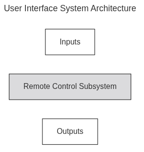
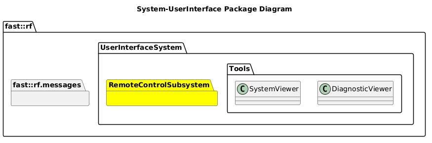

[README](../../../README.md)

[Architecture](../../../doc/Architecture/Architecture.md)

- [System: UserInterface](#system-userinterface)
- [Overview](#overview)
  - [Purpose](#purpose)
  - [General Requirements](#general-requirements)
- [System Architecture](#system-architecture)
- [Inputs](#inputs)
- [Outputs](#outputs)
- [How It Works](#how-it-works)
  - [Detailed Documentation](#detailed-documentation)
  - [Software Content](#software-content)
- [Subsystems](#subsystems)
  - [Package Diagram](#package-diagram)
- [Usage Instructions](#usage-instructions)
- [Validation](#validation)

# System: UserInterface

# Overview

## Purpose

The UserInterface System's role in the Robot Framework is to provide an interface to allow User control of the Robot.

In general, the UserInterface System is different in context than other Systems that run onboard the Robot.  They provide either packages that a user selectively runs at their discretion, and also content that is deployed on a robot that interfaces to a user.

## General Requirements

# System Architecture

# Inputs

The following inputs are required in order for this system to properly function.

| Input | DataType | Description | Requirement |
| ----- | -------- | ----------- | ----------- |

# Outputs

The following outputs are provided by this system.

| Output | DataType | Description | Usage |
| ------ | -------- | ----------- | ----- |

# How It Works

Ideas:

- Diagnostic Viewer
- System Viewer
- Audio/Microphone
- Video Display

## Detailed Documentation

## Software Content

# Subsystems

The following Subsystems are provided in this System:
| State | Subsystem                                                                   | Purpose                                          |
| ----- | --------------------------------------------------------------------------- | ------------------------------------------------ |
| DRAFT | [RemoteControl](../Subsystems/RemoteControl/doc/Subsystem-RemoteControl.md) | Provides SW to support Remote Control operations |

## Package Diagram

# Usage Instructions

# Validation
