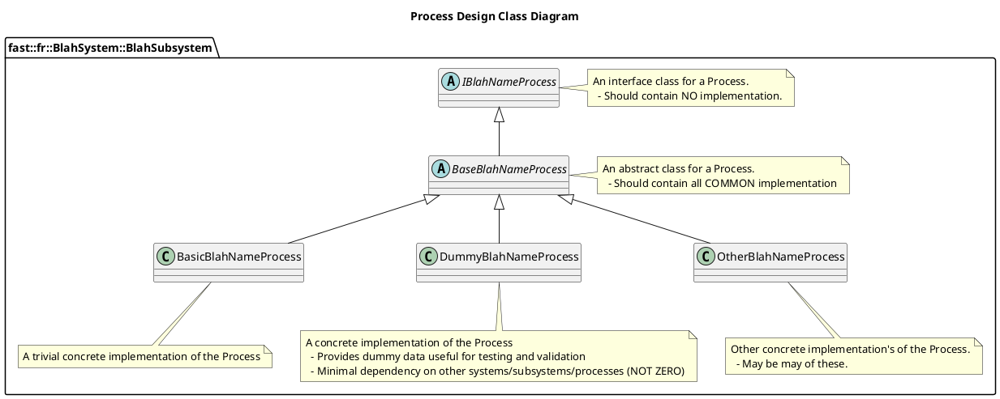

[Architecture Decision Records](../../ADR.md)

- [ADR: Process Design](#adr-process-design)
- [Description](#description)
  - [Design Pattern](#design-pattern)
  - [Interface Design](#interface-design)
- [Alternatives Investigated](#alternatives-investigated)
  - [No default structure](#no-default-structure)
- [Implications](#implications)
- [Follow-up](#follow-up)
- [Deviations](#deviations)

# ADR: Process Design

# Description

The following are Decisions that reflect how a Process is designed.

## Design Pattern

Processes should follow a `Facade` Design Pattern. This pattern allows the ability to:

1. Have a fully validated robot application at the lowest level unit test.
2. Dummy data, simple algorithms, pass-thru algorithms, and complex algorithms can be swapped out at will by the user without requiring any special knowledge.

## Interface Design

Processes should be designed according to the following:

# Alternatives Investigated

## No default structure

If this practice is not standardized, the benefits detailed above won't be available.

# Implications

# Follow-up

# Deviations
