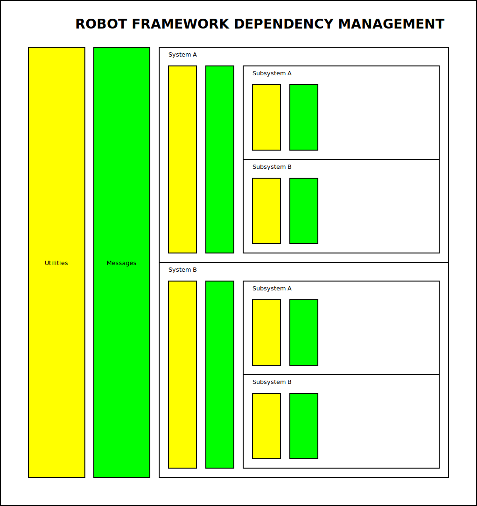

[Architecture Decision Records](../../ADR.md)

- [ADR: Dependency Management](#adr-dependency-management)
- [Description](#description)
- [Alternatives Investigated](#alternatives-investigated)
- [Implications](#implications)
- [Follow-up](#follow-up)
- [Deviations](#deviations)

# ADR: Dependency Management

# Description

The following details the dependencies allowed at all levels in this Robot Framework:

Here as can be seen that all "Vertical" boxes can be shared according to their overlap region. For example,

- Utilities in System A box can be accessed anywhere inside the System A content.
- Utilities in System A box can NOT be accessed anywhere inside System B (or any other System).

Note that this chain continues down to all levels of the robot framework.

This dependency management choice was chosen for the following reasons:

- Makes it more obvious how dependencies are useful (for example, Pose System utilities should generally not be useful to other Systems).

# Alternatives Investigated

# Implications

1. Strong consideration should be made when determining where shared dependencies should be made. For example, is a Pose System utility only useful at the System level, or perhaps it is useful for other systems that use Pose?

# Follow-up

This ADR should be revisited in the future based on the following:

# Deviations

Not following this practice may be unavoidable in some exceptions. These are detailed below:
