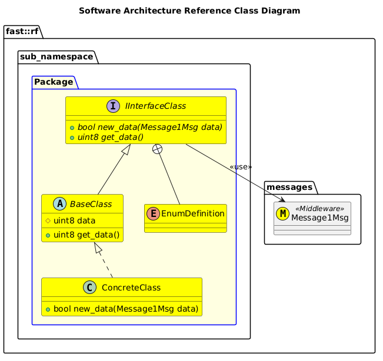

[Architecture Decision Records](../ADR.md)

- [ADR: SoftwareArchitectureDesignReference](#adr-softwarearchitecturedesignreference)
- [Description](#description)
- [Alternatives Investigated](#alternatives-investigated)
- [Implications](#implications)
- [Design](#design)
- [Follow-up](#follow-up)
- [Deviations](#deviations)

# ADR: SoftwareArchitectureDesignReference

# Description
Software Architecture's can follow different styles.  This ADR attempts to provide a common reference for not only how SW should be constructed, and also to show how a design can be interpreted.

The motivation behind all SW Architecture is to communicate useful information.  It's NOT meant to document every API to some module.

# Alternatives Investigated

# Implications

# Design

# Follow-up

This ADR should be revisited in the future based on the following:

# Deviations

Not following this practice may be unavoidable in some exceptions. These are detailed below:
