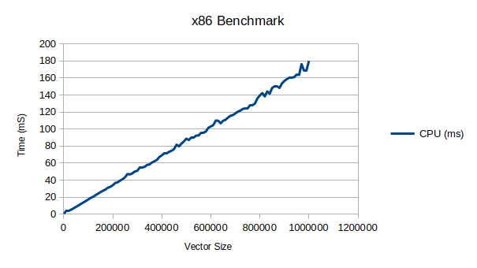
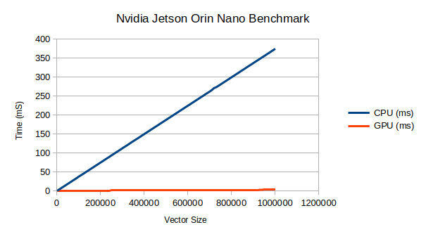
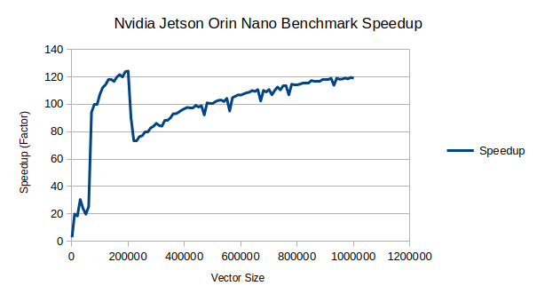

[ADR](../../../016-ADRGPUSoftwareDesign.md)
- [MathTest Example](#mathtest-example)
  - [Purpose](#purpose)
  - [Architecture](#architecture)
    - [Class Diagram](#class-diagram)
  - [Usage](#usage)
  - [Results](#results)
    - [x86 Laptop with NO GPU](#x86-laptop-with-no-gpu)
    - [Nvidia Jetson Orin Nano](#nvidia-jetson-orin-nano)


# MathTest Example

## Purpose
This Example's objectives are the following:
- Provide easily readable code that can be ran on CPU and GPU to show proper SW Architecture
- Prove that GPU is running content correctly
- Give insight on how to construct source-code and build artifacts

## Architecture


### Class Diagram


## Usage
To run this, do the following
**CMake Environment**
```bash
./install/bin/test_cpugpu_math_benchmark 
```

**Colcon/ROS2 Environment**
```bash
./install/robot_framework_ros2/bin/test_cpugpu_math_benchmark
```

## Results
### x86 Laptop with NO GPU
```bash
Vector Size | CPU (ms) | GPU (ms) | Speedup
1000 | 0.39369 | unavailable | unavailable
10000 | 3.8992 | unavailable | unavailable
20000 | 4.29659 | unavailable | unavailable
30000 | 5.13267 | unavailable | unavailable
40000 | 6.7718 | unavailable | unavailable
50000 | 8.47094 | unavailable | unavailable
...
970000 | 176.162 | unavailable | unavailable
980000 | 168.303 | unavailable | unavailable
990000 | 168.65 | unavailable | unavailable
1000000 | 179.911 | unavailable | unavailable

Total benchmark test time: 53.1363 seconds
```


### Nvidia Jetson Orin Nano
```bash
Vector Size | CPU (ms) | GPU (ms) | Speedup
1000 | 0.375337 | 0.114025 | 3.29171x
10000 | 3.77545 | 0.182174 | 20.7244x
20000 | 7.56059 | 0.291982 | 25.8941x
30000 | 11.3575 | 0.366019 | 31.03x
40000 | 15.1293 | 0.672438 | 22.4991x
50000 | 18.9118 | 0.899452 | 21.0259x
60000 | 22.6614 | 0.892418 | 25.3932x
...
910000 | 341.414 | 2.88589 | 118.305x
920000 | 345.17 | 2.90929 | 118.644x
930000 | 348.704 | 2.93214 | 118.925x
940000 | 352.555 | 2.96605 | 118.863x
950000 | 356.348 | 2.98335 | 119.446x
960000 | 360.085 | 3.02267 | 119.128x
970000 | 363.85 | 3.04078 | 119.657x
980000 | 367.502 | 3.04523 | 120.681x
990000 | 371.892 | 3.05786 | 121.619x
1000000 | 375.021 | 3.12833 | 119.879x

Total benchmark test time: 118.841 seconds
```

