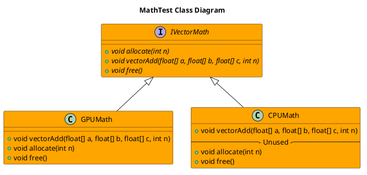

[ADR](../../../016-ADRGPUSoftwareDesign.md)
- [MathTest Example](#mathtest-example)
  - [Purpose](#purpose)
  - [Architecture](#architecture)
    - [Class Diagram](#class-diagram)
  - [Usage](#usage)
  - [Results](#results)
    - [x86 Laptop with NO GPU](#x86-laptop-with-no-gpu)
    - [Nvidia Jetson Orin Nano](#nvidia-jetson-orin-nano)


# MathTest Example

## Purpose
This Example's objectives are the following:
- Provide easily readable code that can be ran on CPU and GPU to show proper SW Architecture
- Prove that GPU is running content correctly
- Give insight on how to construct source-code and build artifacts

## Architecture


### Class Diagram


## Usage
To run this, do the following
**CMake Environment**
```bash
./install/bin/test_cpugpu_math_benchmark 
```

**Colcon/ROS2 Environment**
```bash
./install/robot_framework_ros2/bin/test_cpugpu_math_benchmark
```

## Results
### x86 Laptop with NO GPU
```bash
Total benchmark test time: 569.985 seconds
```

### Nvidia Jetson Orin Nano
