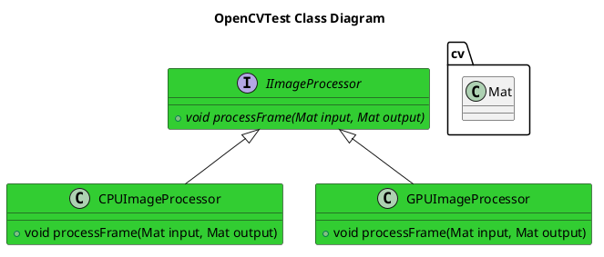

[ADR](../../../016-ADRGPUSoftwareDesign.md)
- [OpenCV Example](#opencv-example)
  - [Purpose](#purpose)
  - [Architecture](#architecture)
    - [Class Diagram](#class-diagram)
  - [Usage](#usage)
  - [Results](#results)
    - [x86 Laptop with NO GPU](#x86-laptop-with-no-gpu)
    - [Nvidia Jetson Orin Nano](#nvidia-jetson-orin-nano)


# OpenCV Example

## Purpose
This Example's objectives are the following:
- Build and run OpenCV content appropriate for an x86 environment
- Provide a similar functionality appropriate for a GPU

It essentially creates a test image and then performs a few image processing functions on it and then saves the resultant image back as a file.


## Architecture


### Class Diagram


## Usage
To run this, do the following
**CMake Environment**
```bash
./install/bin/test_opencv 
```

**Colcon/ROS2 Environment**
```bash
./install/robot_framework_ros2/bin/test_opencv
```

## Results
### x86 Laptop with NO GPU


### Nvidia Jetson Orin Nano
