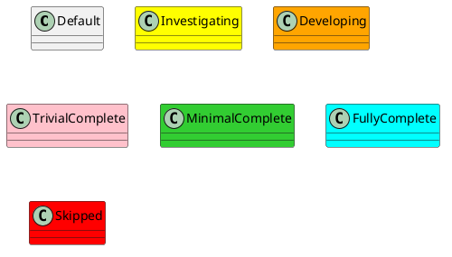
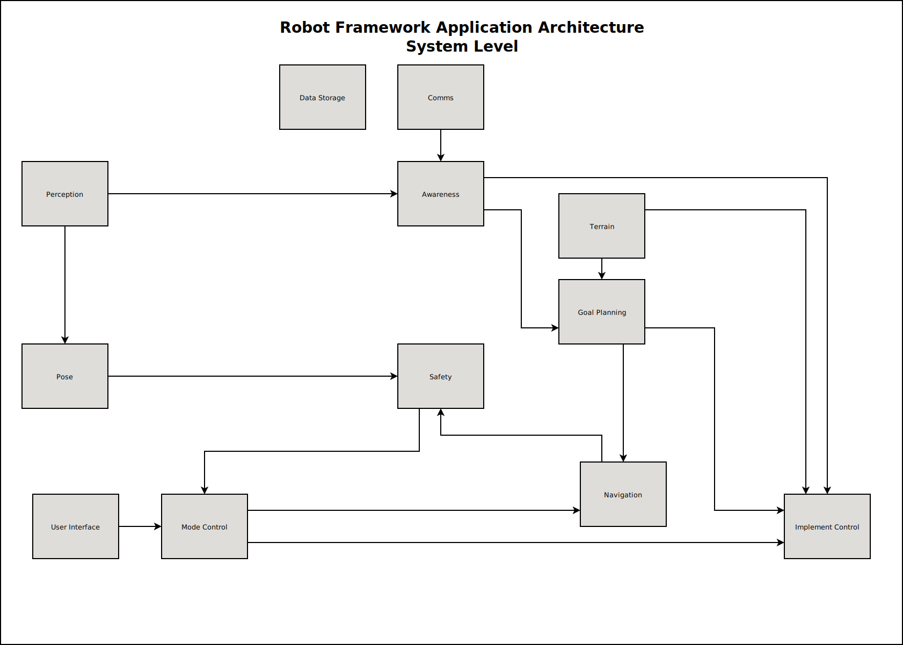

[README](../../README.md)

- [Architecture](#architecture)
- [Overview](#overview)
- [Systems](#systems)

# Architecture

# Overview

The Robot Framework creates a comprehensive Architecture suitable for robotics that can be maintained and expanded on for the long term.

Note that at the System level, only some number of interfaces are called out. There may be more interfaces between systems implemented.

# Systems

| Status | System                                                                             |
| ------ | ---------------------------------------------------------------------------------- |
| NEW    | [Awareness](../../Systems/Awareness/doc/System-Awareness.md)                       |
| NEW    | [Comms](../../Systems/Comms/doc/System-Comms.md)                                   |
| NEW    | [Data Storage](../../Systems/DataStorage/doc/System-DataStorage.md)                |
| NEW    | [Goal Planning](../../Systems/GoalPlanning/doc/System-GoalPlanning.md)             |
| NEW    | [Implement Control](../../Systems/ImplementControl/doc/System-ImplementControl.md) |
| NEW    | [Mode Control](../../Systems/ModeControl/doc/System-ModeControl.md)                |
| NEW    | [Navigation](../../Systems/Navigation/doc/System-Navigation.md)                    |
| NEW    | [Perception](../../Systems/Perception/doc/System-Perception.md)                    |
| DRAFT  | [Pose](../../Systems/Pose/doc/System-Pose.md)                                      |
| NEW    | [Safety](../../Systems/Safety/doc/System-Safety.md)                                |
| NEW    | [Terrain](../../Systems/Terrain/doc/System-Terrain.md)                             |
| NEW    | [User Interface](../../Systems/UserInterface/doc/System-UserInterface.md)          |
