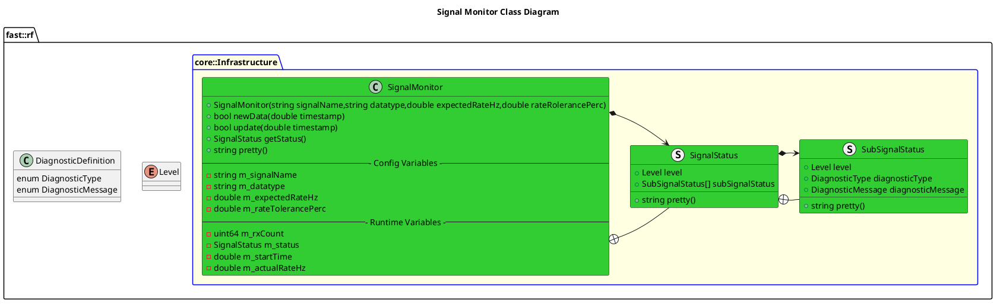

[Infrastructure](../../doc/Infrastructure.md)


- [Signal Monitor](#signal-monitor)
- [Overview](#overview)
  - [Purpose](#purpose)
  - [General Requirements](#general-requirements)
- [How It Works](#how-it-works)
  - [Detailed Documentation](#detailed-documentation)
  - [Class Diagram](#class-diagram)
- [Usage Instructions](#usage-instructions)
- [Validation](#validation)

# Signal Monitor


# Overview

## Purpose

This process's objective is to ???

## General Requirements


# How It Works
The Signal Monitor processes new signal data and computes diagnostics on these signals.  These diagnostics include:
| Diagnostic Type           | Description                                                      |
| ------------------------- | ---------------------------------------------------------------- |
| `DiagnosticType::TIMING`  | Anything related to signal timing (out of order, low rate, etc)  |
| `DiagnosticType::SENSORS` | Health quality of the signal itself.  Performed during AB#<5752> |


## Detailed Documentation


## Class Diagram



# Usage Instructions
```cmake
target_link_libraries(<your library> signalMonitor)
```

```cpp
#include <Infrastructure/SignalMonitor/SignalMonitor.hpp> // Include the header
SignalMonitor signal("signalname", "datatype", expectedRateHz, rateTolerancePerc); // Initialize Signal Monitor
signal.newData(signal_timestamp); // Indicate that a new signal was received.  Should feed it the SIGNAL's timestamp
signal.update(curTime); // Update the Signal Monitor periodically
fast::rf::Level signal_level = signal.getStatus().level; // Get the signal diagnostic level.  Other attributes are present as well in status
```

# Validation
