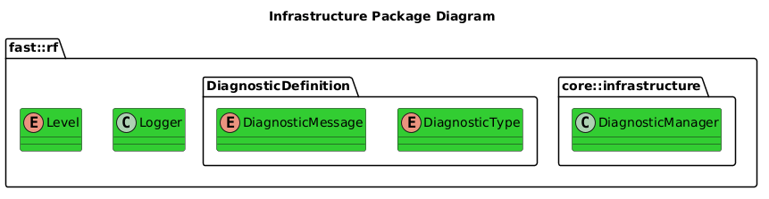

[Architecture](../../../doc/Architecture/Architecture.md)

- [Infrastructure](#infrastructure)

# Infrastructure

# Overview

## Purpose
Infrastructure Content for this framework is useful by any other module freely.  It provides general tools, utilities, etc.

## General Requirements
- All Infrastructure content should only depend on either other Infrastructure Content or Message content.
  
# Architecture

## Package Diagram

## Software Content
| Module                                                              |
| ------------------------------------------------------------------- |
| [Logger](Logger.md)                                                 |
| [Diagnostic Manager](../DiagnosticManager/doc/DiagnosticManager.md) |

# Validation
