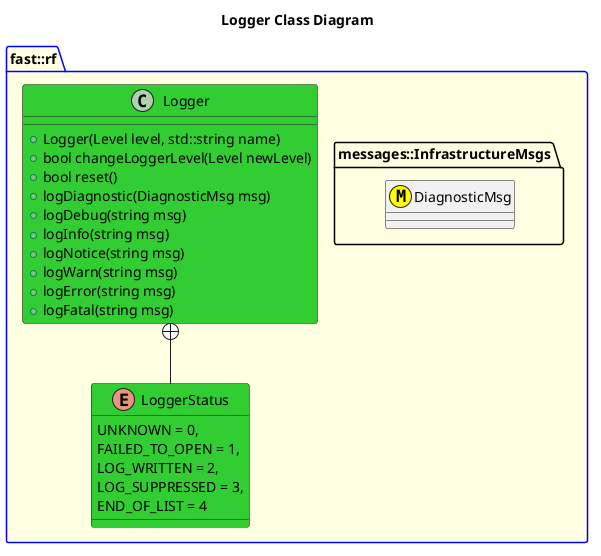

[Infrastructure](Infrastructure.md)

- [Logger](#logger)

# Logger


# Document History

| Version Number | Date        | Author     | Change           |
| :------------: | ----------- | ---------- | ---------------- |
|       0        | 9-July-2026 | David Gitz | Drafted Document |

# Overview

## Purpose
The Logger provides a convenient way to log messages to console and to text files for development and debugging.


## General Requirements

  
# Architecture




# Features
The following features are available in the Logger:
| Feature                                          | Description                                                                                                  |
| ------------------------------------------------ | ------------------------------------------------------------------------------------------------------------ |
| Verbosity Control                                | Log messages with a provided verbosity, that gets skipped if it doesn't meet the configured verbosity level. |
| Console Output                                   | Writes to Console Output                                                                                     |
| File Output                                      | Writes to File                                                                                               |
| Printout includes Timestamps                     |                                                                                                              |
| Printout includes File and Line number of caller |                                                                                                              |
| Printout is colored based on verbosity           |                                                                                                              |

# Usage Guidance
## Integration
To use this in your project, perform the following (Assuming this repo is brought in via cmake):
1. In your CMakeLists.txt file, add:
```CMakeLists.txt
target_link_libraries(<binary orlibrary> logger)
```

2. Add the Header file:
```cpp
#include <Infrastructure/Logger.hpp>
```

1. (Optional) In your main function, initialize the logger:
```cpp
fast::rf::Logger::init(fast::rf::Level::DEBUG, <Object Name>); // Set minimum level appropriately, and set an Object Name (typically the name of the binary).
```

NOTE: If you don't do this, that's perfectly fine, you just won't get an output file.  This is useful in unit tests where you want to utilize the logger but don't want to have a text file output for every test case.  IF you skip this test, the logger will be initialized to a DEBUG level.


## Typical Usage
Wherever you need to log a console/file output(see the note above), simply call:
```cpp
fast::rf::Logger::log_warn("Message") // Or whatever verbosity level is appropriate.
```

# Validation
