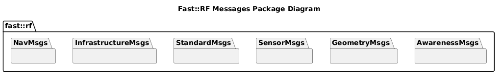
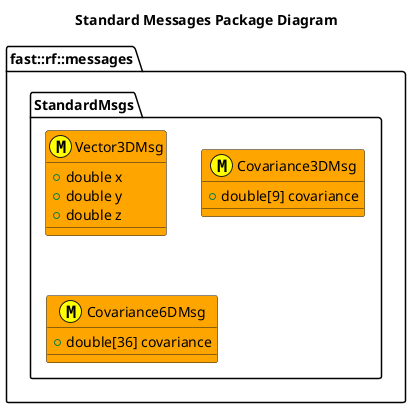
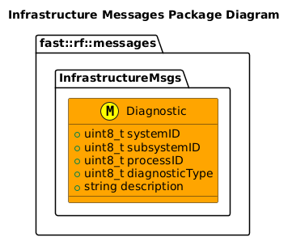

[README](../../README.md)

- [Messages](#messages)
  - [Package Diagram](#package-diagram)
- [Standard](#standard)
- [Awareness](#awareness)
- [Geometry](#geometry)
- [Sensors](#sensors)
- [Navigation](#navigation)
- [Infrastructure](#infrastructure)

# Messages

The following is a listing of all messages created for this framework.

## Package Diagram

# Standard

[Package](../StandardMsgs/)

# Awareness

[Package](../AwarenessMsgs/)

# Geometry

[Package](../GeometryMsgs/)

# Sensors

[Package](../SensorMsgs/)

# Navigation

[Package](../NavMsgs/)

# Infrastructure

[Package](../InfrastructureMsgs/)

